STM32 启动模式、启动文件和链接脚本分析
=================================

本篇文章来自群友 **喵小黑** 的投稿。

# 1 启动模式

几乎每一块刚出场的MCU或其他控制芯片，都在其内部非易失存储器ROM中烧录了最基础的代码，**CPU搬运并运行第一条代码的默认位置**就在ROM的地址空间中，因此，我们可以看到，代码的执行与ROM相关，与硬件紧密联系。

对于Cortex-M系列核心的ARM芯片来说，硬件复位后，首先进行的是以下步骤（以STM32为例，其他厂商MCU部分流程可能会不同）：

1. CPU 内的时序逻辑电路（程序代码下载到内部FLASH为例，FLASH首地址`0x0800 0000`）将PC指针寄存器直接复位到零地址，且根据锁存的**Boot引脚的电平**（启动模式），将不同存储区的首地址映射到零地址处；
2. 硬件从地址0x0取出主堆栈指针（Top of Stack，Set the initial SP），存入SP指针中；
3. 硬件从主堆栈指针后取出复位向量的地址（Set the initial PC == Reset_Handler），存入PC指针中；

**PC指针寄存器直接复位到零地址**，随后从中断向量表表头的`RESET`向量表处获取**下一步跳转的地址**（后续程序代码的PC指针寄存器的初始值）**CPU会从PC指针寄存器指向的地址空间取出指令执行程序，而取完MSP后，一般会执行的第一段代码为复位中断服务程序 Reset_Handler**。

一般情况下（以STM32G474RE+GCC为例），复位程序会根据SDK提供的初始化汇编脚本，（目录为`/Core/Startup/startup_stm32g474retx.s`）,初始化存放在片上SRAM中的bss节（初值为0或者没有设置初值的变量）和data节（初值非0）,以及其他SDK代码运行所需节的变量，随后执行`/Core/Src/system_stm32g4xx.c`中的`SystemInit`函数对核心功能（如`FPU`）进行使能,之后对`Newlib`初始化后跳转进入main函数。


## 1.1 启动模式选择

我们可以看到STM32的存储器架构中，无论是厂家内置的的内部引导Rom（`BootROM of System Flash`，`Rom Code`）中的引导加载程序（`BootLoader`）还是Code Flash内的用户应用程序，亦或者是应用于SRAM中的调试代码，**其地址都不在`0x0000 0000`上**，而通过地址映射，可以将三种不同（亦或更多）的存储空间地址映射到`0x0000 0000`地址处，也即**启动模式选择**。对于STM32和部分其他厂商的MCU来说，**通过`Boot`引脚的选择（只在上电时检测，复位后重新锁存）来确定存储空间的映射是最常见可靠的一种方式**，可以实现将CodeFlash、System Flash或SRAM的首地址映射到`0x0000 0000`，实现程序从不同的存储器位置启动。

> 注：启动模式只决定程序烧录的位置，复位后，需要重新锁存Boot引脚的选择。STM32上电复位以后，代码区都是从`0x0000 0000`开始的，启动模式只是将各自存储空间的地址映射到`0x0000 0000`。
>
> 相比F1，F4的启动方式，H7的启动方式更灵活些，只需一个boot引脚即可。但是一个引脚只能区分出两个状态，为了解决这个问题，H7专门配套了两个option bytes选项字节来解决此问题。

以STM32的Cortex-M核心MCU为例，启动时PC指针会固定跳转到0地址处，可以将System Boot、Internal Flash亦或者Internal SRAM的地址映射到0地址处，更有甚者，我们可以映射External Flash、External RAM到0地址处。这需要外部Boot引脚的电平引脚的配比来实现，有时也需要硬件的XIP功能以及二次引导代码的支持（放在Internal Flash起始处，并映射到0地址）。

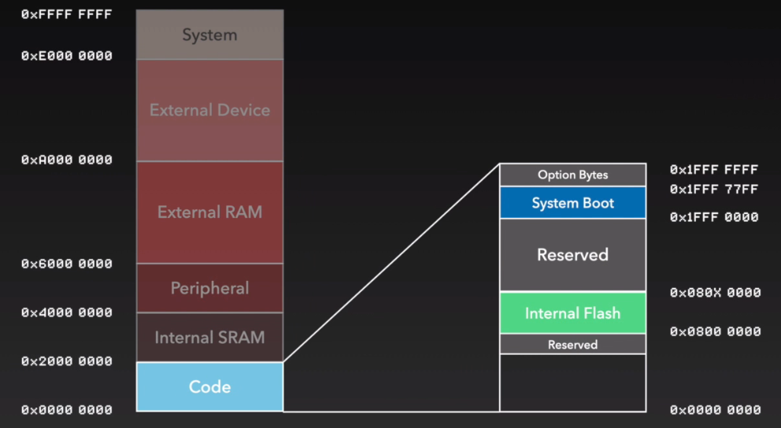

STM32的三种基本启动模式：

1. 主闪存存储器(`Main Flash`)启动：从STM32内置的Flash启动(`0x0800 0000`-`0x0807 FFFF`)，一般我们使用`JTAG`或者`SWD`调试接口下载程序时，就是直接写入到Flash里面，重启后也直接从这启动程序。以`0x0800 0000` 对应的内存为例，则该块内存既可以通过`0x0000 0000` 操作也可以通过`0x0800 0000` 操作，且都是操作的同一块内存。
2. 系统存储器(`System Memory`)启动：从系统存储器启动(`0x1FFF F000` - `0x1FFF F7FF`)，这种模式启动的程序功能是由厂家设置的。一般来说，我们选用这种启动模式时，是为了从串口下载程序，因为在厂家提供的`ISP`程序中，提供了串口下载程序的固件，可以通过这个`ISP`程序将用户程序下载到系统的Flash中。以`0x1FFF FFF0`对应的内存为例，则该块内存既可以通过`0x0000 0000` 操作也可以通过`0x1FFF FFF0`操作，且都是操作的同一块内存。
3. 片上SRAM启动：从内置SRAM启动(`0x2000 0000`-`0x3FFF FFFF`)，既然是SRAM，自然也就没有程序存储的能力了，这个模式一般用于程序调试。SRAM 只能通过`0x2000 0000`进行操作，与上述两者不同。**从SRAM 启动时，需要在应用程序初始化代码中重新设置向量表的位置。（ST在SystemInit函数中预先提供了重定向中断向量表的操作，声明对应的宏即可自动重定向）**

<center>表. F1/F4等系列MCU的启动模式选择</center>


<center>表.H7的启动模式选择</center>

| BOOT引脚 | BOOT选项寄存器 | BOOT区域                                                     |
| -------- | ------------------ | ------------------------------------------------------------ |
| 0        | BOOT_ADD0[15:0]    | 启动地址由BOOT_ADD0定义，默认值是0x0800，对应Flash首地址0x0800 0000。 |
| 1        | BOOT_ADD1[15:0]    | 启动地址由BOOT_ADD1定义，默认值是0x1FF0，对应系统bootloader的首地址0x1FF0 0000。 |

> BOOT_ADD0和BOOT_ADD1对应32位地址到高16位，这点要特别注意。通过这两个选项字节，所有0x0000 0000到0x3FFF 0000的存储器地址都可以设置，包括：
>
> 1. 所有Flash地址空间；
> 2. 所有RAM地址空间，ITCM，DTCM和SRAM。
>
> 设置了选项字节后，**掉电不会丢失**，下次上电或者复位后，会根据BOOT引脚状态从BOOT_ADD0，或BOOT_ADD1所设置的地址进行启动。

## 1.2 为什么STM32的Flash地址要设置到0x0800 0000

ARM官方回复：[Documentation – Arm Developer](https://developer.arm.com/documentation/ka001328/latest)

翻译成中文，ARM官方的回答的意思如下：

> 复位后，Cortex-M3内核只能从0x0地址启动，但通过写向量偏移寄存器VTOR（`0xE000 ED08`），可以在程序执行过程中重定位中断向量表。
>
> Cortex-M3内核的启动顺序与传统ARM内核不同，复位后，在地址0x0提取的第一个参数为SP的初始值，第二个参数（位于`0x0000 0004`）为复位中断服务程序地址，即程序代码的起始地址。另一件需要注意的事是Cortex-M3的中断向量表入口是地址值，而不是像传统ARM内核的分支指令。此外，创建一个`bit[0]`大小的表项还会在与该向量对应的中断处理程序的第一条指令上产生INVESTATE错误。


### 1.2.1 背景知识

从上文我们可以知道，M3，M4内核芯片上电复位后，要固定从0x0000 0000地址读取中断向量表，获取复位中断服务程序的入口地址后，进入复位中断服务程序，其中**0x0000 0000是栈顶地址（MSP），0x0000 0004存的是复位中断服务程序地址**。


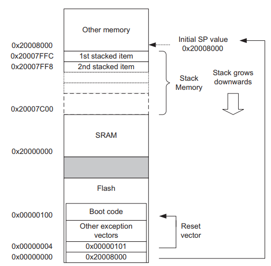

### 1.2.2 问题解释

既然ARM规定了M3，M4内核要从地址`0x0000 0000`读取中断向量表，而STM32设置Flash地址到`0x0800 0000`怎么办？

STM32支持内存重映射功能，将**地址`0x0800 0000`开始的内容重映射**到首地址`0x0000 0000`中，这样就解决了从`0x0000 0000`读取中断向量表的问题。

图示，以STM32F407IGT6为例，0x0000 0000和0x0800 0000开始的程序对比，并没有什么不同：


### 1.2.3 怎么保证0x08000 0000首地址存的就是中断向量表，不可以随意设置吗？

保证中断向量表存到0x0800 0000，这个涉及到分散加载（链接脚本）的一个小知识，以MDK为例，如果大家看xxx.S启动文件，里面通过`AREA`定义了一个名叫`RESET`的段，这段存的就是中断向量表。

```
; Vector Table Mapped to Address 0 at Reset
                AREA    RESET, DATA, READONLY
                EXPORT  __Vectors
                EXPORT  __Vectors_End
                EXPORT  __Vectors_Size
```

这个名字很重要，MDK对应的xxx.sct分散加载（GCC下的链接脚本也将中断向量表放在`.text`段的开头）里面通过下面这句将这个`RESET`段放在了`0x0800 0000`优先存储。

```
; *************************************************************
; *** Scatter-Loading Description File generated by uVision ***
; *************************************************************

LR_IROM1 0x08000000 0x00200000  {    ; load region size_region
  ER_IROM1 0x08000000 0x00200000  {  ; load address = execution address
   *.o (RESET, +First)
   *(InRoot$Sections)
   .ANY (+RO)
   .ANY (+XO)
  }
  RW_IRAM2 0x24000000 0x00080000  {  ; RW data
   .ANY (+RW +ZI)
  }
}
```

> GCC的实现方式类似，是在链接脚本内SECTIONS部分开头部位定义了.isr_vector段用于存放中断向量表，这样链接器进行链接时按顺序安置变量就会将其放在`0x0800 0000`。

```
SECTIONS
{
  /* The startup code into "FLASH" Rom type memory */
  .isr_vector :
  {
    . = ALIGN(4);
    KEEP(*(.isr_vector)) /* Startup code */
    . = ALIGN(4);
  } >FLASH

...
```

这样我们就解决了`0x0800 0000`首地址存储中断向量表，一旦程序开始运行后，我们就可以随意设置中断向量表的位置了。比如想将中断向量表存到内部SRAM，我们就可以操作寄存器`SCB->VTOR` 重新安排，然后将`0x0800 0000`的内容复制到设置的地址内即可。

### 1.2.4 设置到0x0800 0000这么麻烦，为什么不直接使用0x0000 0000？

回到这一个小节问题的本身，为什么不直接使用0x0000 0000？

因为STM32不仅可以从内部Flash启动，还可以从系统存储器（可以实现串口ISP，USB DFU等程序下载方式，<font color="#dd0000">这个程序是ST固化好的程序代码</font>）和从内部SRAM启动，我们将内部Flash安排到0x0000 0000显然是不行的。这样会导致系统存储器或者内部SRAM无法重映射到0x0000 0000了。


### 1.2.5 了解了M3和M4，M7是怎么个执行情况呢？

M7内核比较灵活，改变了固定从0x0000 0000地址读取中断向量表，以STM32H7为例，<font color="#dd0000">可以从 0x0000 0000 到 0x3FFF 0000 所有地址进行启动</font>，并且专门安排了个选项字节来配置。


> H7里面没有传统风格的重映射，它的首地址0x0000 0000安排给ITCM RAM空间使用。

以下，我们结合正点原子的MiniPRO STM32H750开发板 HAL库例程的 实验 1 跑马灯实验中，取出的`MSP`和`PC`的值是多少，方法如图。

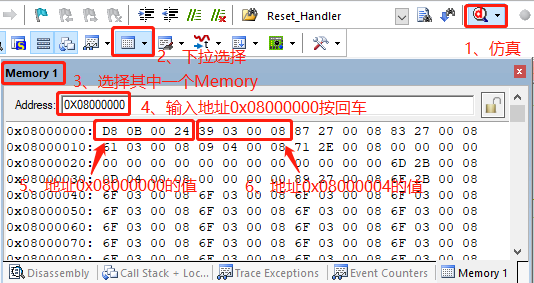

由图可以知道地址`0x0800 0000`的值是`0x2400 0BD8`，地址`0x0800 0004`的值是`0x0800 0339`，即 堆栈指针SP = `0x2400 0BD8`程序计数器指针PC = `0x0800 0339`（即复位中断服务程序`Reset_Handler`的入口地址），因为**CM7内核是小端模式，所以字节之间倒着读**。

> 注意，这与传统的ARM架构不同，其实也和绝大多数其它架构MCU不同。**传统的ARM架构总是从0地址开始执行第一条指令**，它们的`0`地址处总是一条跳转指令。而在CM3内核中，`0`地址处提供`MSP`的初始值，然后是向量表（**向量表在启动之后还可以被移至其它位置**）。向量表中的数值是32位的地址，而不是跳转指令。向量表的第一个条目指向复位后应执行的第一条指令，就是`Reset_Handler`这个函数。

下面继续以跑马灯实验为例，代码从地址`0x0800 0000`开始被执行，讲解系统启动，初始化堆栈、`MSP`和`PC`后的内存情况。


因为CM7使用的是**向下生长的满栈**，所以**MSP的初始值必须是堆栈内存的末地址加1（MSP是栈顶指针）**。举例来说，如果你的栈区域在`0x2400 03D8`~`0x2400 0BD4`，2KB大小）之间，那么`MSP`的初始值就必须是`0x2400 0BD8`。

**向量表跟随在MSP的初始值之后,也就是第2个表目。**

`r15`是程序计数器，在汇编代码中，可以使用名字`PC`来访问它。**MCU主要执行Thumb指令(指令长度更短，节约空间)**。**此外，读PC时返回的值是当前指令的地址+4**。比如说：

```c
0x1000: MOV R0, PC ; R0 = 0x1004
```

正因为上述原因，使用`0x0800 0339`来表达地址`0x0800 0338`。**当`0x0800 0339`处的指令得到执行后，就正式开始了程序的执行（即去到C的世界）**。所以在此之前**初始化`MSP`是必需的**，因为可能第1条指令还没执行就会被`NMI`或是其它异常打断。**`MSP`初始化好后就已经为它们的服务例程准备好了堆栈。**

# 2 STM32 启动文件分析（基于GCC）

 参考链接：[Using as (sourceware.org)](https://sourceware.org/binutils/docs/as.html#Word)，需要注意的是我们的主要内容参考`ELF`格式。

> GCC下启动文件实现的功能与在MDK环境下启动文件实现的功能并无本质上的区别，此处结合startup_stm32h750xx.s进行说明。

```
/**
  ******************************************************************************
  * @file      startup_stm32h750xx.s
  * @author    MCD Application Team
  * @brief     STM32H750xx Devices vector table for GCC based toolchain. 
  *            This module performs:
  *                - Set the initial SP
  *                - Set the initial PC == Reset_Handler,
  *                - Set the vector table entries with the exceptions ISR address
  *                - Branches to main in the C library (which eventually
  *                  calls main()).
  *            After Reset the Cortex-M processor is in Thread mode,
  *            priority is Privileged, and the Stack is set to Main.
  ******************************************************************************
  * @attention
  *
  * Copyright (c) 2018 STMicroelectronics.
  * All rights reserved.
  *
  * This software component is licensed by ST under BSD 3-Clause license,
  * the "License"; You may not use this file except in compliance with the
  * License. You may obtain a copy of the License at:
  *                        opensource.org/licenses/BSD-3-Clause
  *
  ******************************************************************************
  */
```

## 2.1 常见的GNU汇编伪代码/指令

以下为GNU汇编伪代码与ARM汇编伪代码的对应关系，但实际上他们并不完全相同。

具体的可以参考[Using as (sourceware.org)](https://sourceware.org/binutils/docs/as.html#Word)。

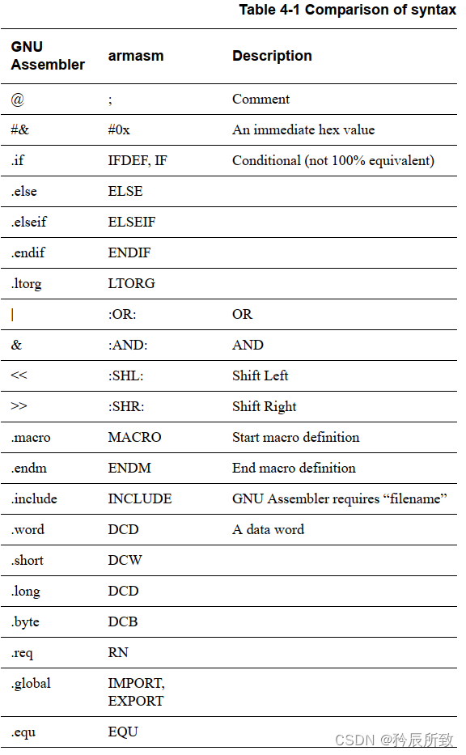

以下为启动文件的作用说明，基本按照从上往下的格式进行描述。

## 2.2 基本说明

`startup_stm32h750xx.s`的开头部分是基本说明。

1. 表示使用统一的`ARM/Thumb`汇编语法。[ARM-Instruction-Set (Using as) (sourceware.org)](https://sourceware.org/binutils/docs/as/ARM_002dInstruction_002dSet.html#ARM_002dInstruction_002dSet)

```assembly
.syntax unified 
```

2. 表示指定所需的核心版本为`cortex-m7`。[Syntax](https://sourceware.org/binutils/docs/as.html#ARC-Syntax)

```assembly
  .cpu cortex-m7
```

3. 选择要组装的浮点单元为`softvfp`，软浮点（`Soft-float`），浮点单元即`VFP`(`vector floating-point`)。[ARM Machine Directives](https://sourceware.org/binutils/docs/as.html#ARM-Directives)

```assembly
  .fpu softvfp
```

4. 选择`THUMB`指令集，执行与`.code 16`相同的操作，使`thumb`模式等价于`.code 16;gcc -mthumb`。[ARM Machine Directives](https://sourceware.org/binutils/docs/as.html#ARM-Directives)

```assembly
  .thumb
```

5. 定义两个全局符号，这两个符号对链接文件可见， `g_pfnVectors`为中断向量表，`Default_Handler`为默认中断。

```assembly
.global  g_pfnVectors					/* 定义两个全局符号，这两个符号对链接文件可见， g_pfnVectors为中断向量表 */  
.global  Default_Handler				/* Default_Handler为默认中断 */ 
```

6. `.word`表示了在当前位置放一个`word`型的值，可以理解为一个变量或者数据定义，这个变量同样对对`.ld`（链接文件）可见。
7. 定义的变量包括`_sidata, _sdata, _edata, _sbss, _ebss`，分别用于表示带初始化值的`.data`段起始地址，`.data`段的起始地址和结束地址，`.bss`段的起始地址和结束地址。
8. 注释中`SystemInit_ExtMemCtl`表示配置外部RAM。

```assembly
/* start address for the initialization values of the .data section. 
defined in linker script */		
.word  _sidata					
/* start address for the .data section. defined in linker script */  
.word  _sdata
/* end address for the .data section. defined in linker script */
.word  _edata
/* start address for the .bss section. defined in linker script */
.word  _sbss
/* end address for the .bss section. defined in linker script */
.word  _ebss
/* stack used for SystemInit_ExtMemCtl; always internal RAM used */
```

## 2.3 Reset_Handler复位中断服务程序

```assembly
/**
 * @brief  This is the code that gets called when the processor first
 *          starts execution following a reset event. Only the absolutely
 *          necessary set is performed, after which the application
 *          supplied main() routine is called. 
 * @param  None
 * @retval : None
*/

    .section  .text.Reset_Handler
  .weak  Reset_Handler
  .type  Reset_Handler, %function
Reset_Handler:  
  ldr   sp, =_estack      /* set stack pointer */

/* Copy the data segment initializers from flash to SRAM */  
  movs  r1, #0
  b  LoopCopyDataInit
```

1. 开头注释表明：这部分代码在芯片第一次启动或复位后，需要执行的一些必要的操作，在此之后启动main()函数执行；
2. `.section .text.Reset_Handler`这里表示定义的是`.text`节中的`Reset_Handler`节；
3. `.weak`将`Reset_Handler`设置为弱属性，如果符号不存在，将创建它们。(弱定义，如果有其他强定义则用强定义替代)，即当我们在程序内定义一个`Reset_Handler`函数时，这部分将不起作用；
4. `.type`将符号`Reset_Handler`的类型设置为函数名；
5. `Reset_Handler`函数的主要作用是：`ldr`指令用于从内存中将一个32位的字读取到指令中的目标寄存器中，即将`_estack`栈底赋值给`SP`，将`R1`寄存器赋值为0，`B`指令跳转至`CopyDataInit`函数，通过函数名可以看出，这里是对数据进行初始化。

## 2.4 将`.data`段从`FLASH`移动到`RAM`，将`.bss`段清零

参考链接：[Could you explain BCC command to me? - Architectures and Processors forum - Support forums - Arm Community](https://community.arm.com/support-forums/f/architectures-and-processors-forum/5941/could-you-explain-bcc-command-to-me)

[(3条消息) 汇编指令 BCC/BLO_瑞欧莱的博客-CSDN博客_blo指令](https://blog.csdn.net/weixin_41608556/article/details/120801250?spm=1001.2101.3001.6661.1&utm_medium=distribute.pc_relevant_t0.none-task-blog-2~default~CTRLIST~Rate-1-120801250-blog-17934511.pc_relevant_3mothn_strategy_recovery&depth_1-utm_source=distribute.pc_relevant_t0.none-task-blog-2~default~CTRLIST~Rate-1-120801250-blog-17934511.pc_relevant_3mothn_strategy_recovery&utm_relevant_index=1)

[Condition Codes 1: Condition flags and codes - Architectures and Processors blog - Arm Community blogs - Arm Community](https://community.arm.com/arm-community-blogs/b/architectures-and-processors-blog/posts/condition-codes-1-condition-flags-and-codes)

```assembly
CopyDataInit:
  ldr  r3, =_sidata			// _sidata为.data段中初始化值的起始地址
  ldr  r3, [r3, r1]
  str  r3, [r0, r1]
  adds  r1, r1, #4
    
LoopCopyDataInit:
  ldr  r0, =_sdata			// _sdata为.data段的起始地址
  ldr  r3, =_edata			// _edata为.data段的结束地址
  adds  r2, r0, r1
  cmp  r2, r3				// R2-R3 < 0，C清零， R2-R3 ≥ 0， C置位
  bcc  CopyDataInit			//  Branch if Carry Clear，判断C位
  ldr  r2, =_sbss
  b  LoopFillZerobss
/* Zero fill the bss segment. */  
FillZerobss:
  movs  r3, #0
  str  r3, [r2], #4
    
LoopFillZerobss:
  ldr  r3, = _ebss
  cmp  r2, r3
  bcc  FillZerobss
```

`ARM`汇编语言中有16个可能的条件分支，包括“always”（实际上是一个无条件分支）和“never”（从未使用过，但存在于未来可能的架构扩展中）。下表给出了完整的分支指令集：

| **Branch** | **Condition Test**                                           | **Meaning**      | **Uses**                                             |
| ---------- | ------------------------------------------------------------ | ---------------- | ---------------------------------------------------- |
| B          | No test                                                      | Unconditional    | Always take the branch                               |
| BAL        | No test                                                      | Always           | Always take the branch                               |
| BEQ        | Z=1                                                          | Equal            | Comparison equal or zero result                      |
| BNE        | Z=0                                                          | Not equal        | Comparison not equal or non-zero result              |
| BCS        | C=1                                                          | Carry set        | Arithmetic operation gave carry out                  |
| BCC        | C=1                                                          | Carry clear      | Arithmetic operation did not produce a carry         |
| BHS        | C=1                                                          | Higher or same   | Unsigned comparison gave higher or same result       |
| BLO        | C=0                                                          | Lower            | Unsigned comparison gave lower result                |
| BMI        | N=1                                                          | Minus            | Result is minus or negative                          |
| BPL        | N=0                                                          | Plus             | Result is positive (plus) or zero                    |
| BVS        | V=1                                                          | Overflow Set     | Signed integer operation: overflow occurred          |
| BVC        | V=0                                                          | Overflow Clear   | Signed integer operation: no overflow occurred       |
| BHI        | ((NOT C) OR Z) =0 {C set and Z clear}                        | Higher           | Unsigned comparison gave higher                      |
| BLS        | ((NOT C) OR Z) =1 {C set or Z clear}                         | Lower or same    | Unsigned comparison gave lower or same               |
| BGE        | (N EOR V) =0 {(N and V) set or (N and V) clear}              | Greater or Equal | Signed integer comparison gave greater than or equal |
| BLT        | (N EOR V) =1 {(N set and V clear) or (N clear and V set)}    | Less Than        | Signed integer comparison gave less than             |
| BGT        | (Z OR (N EOR V)) =0 {((N and V) set or clear) and Z clear}   | Greater Than     | Signed integer comparison gave greater than          |
| BLE        | (Z OR (N EOR V)) =1 {(N set and V clear) or (N clear and V set) or Z set} | Less or Equal    | Signed integer comparison gave less than or equal    |

1. `LoopCopyDataInit`函数的主要作用是：将`_sdata`赋值给`R0`，将`_edata`赋值给`R3`，将`R0`和`R1`的相加结果给`R2`，注意`R1`这里是0（FLASH的0起始地址），`cmp`比较`R2`与`R3`，`bcc`进行无进位转移，如果`R2<R3`，表示有初始化值需要从`FLASH`复制到`RAM`，则进入`CopyDataInit`函数，否则则将`R2`置为`_sbss`并跳转至`LoopFillZerobss`。
2. `CopyDataInit`函数的主要作用是将`.data`段的初始化值从`FLASH`复制到`RAM`，先将`_sidata`赋值给`R3`，将`R3+R1`的地址单元的值存入`R3`，将`R3`的值存入`R0+R1`的地址单元，然后将`R1`的值加4（复位函数的入口地址）。
3. `LoopFillZerobss`函数的主要作用是将`.bss`段清零，此时`R2`为`_sbss`，将`_ebss`赋值给`R3`，`cmp`比较`R2`与`R3`，`bcc`进行无进位转移，如果`R2<R3`，则有`.bss`段的值需要初始化，调用`FillZerobss`函数。
4. `FillZerobss`函数的主要作用就将`.bss`段清零，将0赋值给`R3`，然后将`R3`的值存入`R2+4`的地址单元中。

> 其实大家发现没有，`LoopCopyDataInit`函数和`LoopFillZerobss`函数好像都只调用了一次，但明明名字里带了Loop（循环），那他们是怎么实现循环的呢？这就涉及到汇编的又一个知识点：**语句是顺序执行**的，而我们摘出来的四个函数的顺序是`CopyDataInit`➡`LoopCopyDataInit`➡`FillZerobss`➡`LoopFillZerobss`，也就是说程序运行的步骤其实如下图所示。

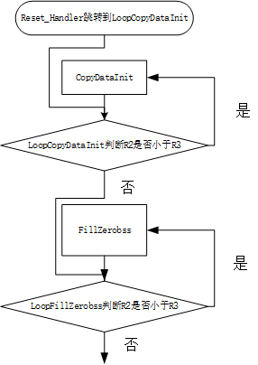

## 2.5 调用`SystemInit`并转入到C的世界

> 此处使用的是GCC下RTT的启动文件，以`entry()`函数作为C语言的入口。

```assembly
/* Call the clock system intitialization function.*/
  bl  SystemInit   
/* Call static constructors */
/* bl __libc_init_array */
/* Call the application's entry point.*/
  bl  entry
  bx  lr    
.size  Reset_Handler, .-Reset_Handler
```

1. `bl __libc_init_array`指用了C++代码，需要`__libc_init_array` 来初始化一些东西， 在C++中，全局变量和静态变量的构造函数需要在main函数执行前执行，这些构造函数会放在`init_array`表中，`__libc_init_array`函数有调用这些函数的代码；
2. 跳转`main`函数，当`main`函数执行退出后执行`BX LR`跳转回`LR`寄存器，这时候就从`main`函数跳出来了；
3. `.size Reset_Handler, .-Reset_Handler`（ELF格式下隐含标识一个段的结束的意思）该指令设置为与符号名称关联的大小，表示`Reset_Handler`函数结束。


## 2.6 默认中断服务函数

```assembly
/**
 * @brief  This is the code that gets called when the processor receives an 
 *         unexpected interrupt.  This simply enters an infinite loop, preserving
 *         the system state for examination by a debugger.
 * @param  None     
 * @retval None       
*/
    .section  .text.Default_Handler,"ax",%progbits
Default_Handler:
Infinite_Loop:
  b  Infinite_Loop
  .size  Default_Handler, .-Default_Handler
```

1. 注释说明如果处理器收到一个未预料的中断，将会进入这个死循环中，即`Default_Handler`（此处不同于MDK，GCC环境下，先跳转到`Default_Handler`再跳转到相应的中断服务函数）；
2. `.section .text.Default_Handler`这里表示定义的是`.text`段中的`Reset_Handler`段，ax表示权限，ax是 allocation execute的缩写，表示该节区可分配并且可执行，`progbits`是`type`，表示此段包含数据，详细定义为`.section section_name [, “flags”[, %type[,flag_specific_arguments]]] `。

## 2.7 中断向量表和中断服务函数

1. 注释部分，表明中断向量表需要在物理地址`0x00000000`的位置上，如果是IAP当然可以通过程序后续配置调整地址大小，但是第一次启动必然要从0开始；
2. `section .isr_vector,"a",%progbits`定义中断向量段和它的类型，a表示可分配，`%progbits`表示段内包含数据；
3. `.type g_pfnVectors, %object`段符号名为`g_pfnVectors`，`%object`表示符号为数据对象；
4. `.size g_pfnVectors, .-g_pfnVectors`表示`g_pfnVectors`的大小是从当前位置-定义位置；
5. `word _estack`在当前位置放置一个word型的值，这个值为`_estack`（这个值是栈顶的值，存在flash的0偏移地址处），后面同理；
6. `.thumb_set NMI_Handler,Default_Handler`等效于.set指令，因为它创建了一个符号，该符号是另一个符号的别名（可能尚未定义）。 该指令还具有添加的属性，因为它以`.thumb_func`指令相同的方式将别名符号标记为thumb函数入口点。即`NMI_Handler`默认用`Default_Handler`替代，但同时`NMI_Handler`还是个若引用，因此当我们在程序里定义了这个中断服务函数的时候，就会替代这里。

```assembly
/******************************************************************************
*
* The minimal vector table for a Cortex M. Note that the proper constructs
* must be placed on this to ensure that it ends up at physical address
* 0x0000.0000.
* 
*******************************************************************************/
   .section  .isr_vector,"a",%progbits			// 将下面的代码组合成名为`.isr_vector`的段，"a"表示此段是可以分配的，%progbits表示此段包含数据
  .type  g_pfnVectors, %object					// 段符号名为g_pfnVectors，%object表示符号为数据对象
  .size  g_pfnVectors, .-g_pfnVectors			// g_pfnVectors的大小为从位置计数器的值-g_pfnVectors
   
   
g_pfnVectors:
  .word  _estack								// 在当前位置放置一个word型的值，这个值为_estack，这个值是栈顶的值，存在flash的0偏移地址处
  .word  Reset_Handler

  .word  NMI_Handler
  .word  HardFault_Handler
  .word  MemManage_Handler
  .word  BusFault_Handler
  .word  UsageFault_Handler
  .word  0
  .word  0
  .word  0
  .word  0
  .word  SVC_Handler
  .word  DebugMon_Handler
  .word  0
  .word  PendSV_Handler
  .word  SysTick_Handler
  
  /* External Interrupts */
  .word     WWDG_IRQHandler                   /* Window WatchDog              */                                        
  .word     PVD_AVD_IRQHandler                /* PVD/AVD through EXTI Line detection */

  ...

  .word     0                                 /* Reserved                   */      
  .word     WAKEUP_PIN_IRQHandler             /* Interrupt for all 6 wake-up pins */

/*******************************************************************************
*
* Provide weak aliases for each Exception handler to the Default_Handler. 
* As they are weak aliases, any function with the same name will override 
* this definition.
* 
*******************************************************************************/
   .weak      NMI_Handler
   .thumb_set NMI_Handler,Default_Handler
   // 等效于.set指令，创建了一个符号，该符号是另一个符号的别名（可能尚未定义）。 该指令还具有添加的属性，因为它以.thumb_func指令相同的方式将别名符号标记为thumb函数入口点。即NMI_Handler默认用Default_Handler替代，但同时NMI_Handler还是个若引用，因此当我们在程序里定义了这个中断服务函数的时候，就会替代这里。
  
   .weak      HardFault_Handler
   .thumb_set HardFault_Handler,Default_Handler
  
   .weak      MemManage_Handler
   .thumb_set MemManage_Handler,Default_Handler
  
    ...
   
   .weak      SAI4_IRQHandler            
   .thumb_set SAI4_IRQHandler,Default_Handler 

   .weak      WAKEUP_PIN_IRQHandler            
   .thumb_set WAKEUP_PIN_IRQHandler,Default_Handler 
   
/************************ (C) COPYRIGHT STMicroelectronics *****END OF FILE****/     
```

# 3 STM32链接脚本分析（基于GCC）

> 需要注意的是，我们这里只介绍stm32在gcc中常用的关键字和命令，实际上`Linker Scripts`所拥有的关键字和命令远远不止这些，如果我们真的想要去了解可以看一下以下这份文件：[Top (LD) (sourceware.org)](https://sourceware.org/binutils/docs/ld/index.html)
>
> MDK、IAR、GCC三种编译器的链接脚本分别为link.sct（一般也称为分散加载文件）、link.icf、link.lds。

链接脚本一般可以通过**文本编辑器或链接脚本编辑器**来进行操作。以下为在RT-Thread GCC环境下的文本编辑器和链接脚本编辑器。


**编译的整个过程分为：预处理、编译、汇编和链接。**链接器的主要作用是将多个`object(.o)`文件或`archive(.a)`文件的内容重定位`(relocate)`并将`Symbol Reference`信息一并输出到二进制文件`(Binary)`或其他可执行文件`(.exe)`中。链接是编译产生二进制文件的最后一个步骤，在执行的过程中依照`Link Command Language文件`描述的方式去产生二进制文件，`LD`文件支持[不同的二进制格式]([BFD (LD) (sourceware.org)](https://sourceware.org/binutils/docs/ld/BFD.html#BFD))。

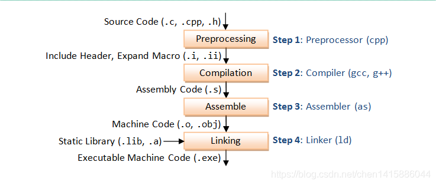

在我们的STM32中，常见的节定义有：

1. `.text`节：代码节，用来存放 **代码** 及一些 **只读常量**，一般是只读的区域；
2. `.data`节：数据节，用来存放全局初始化变量，以及全局或局部 **静态变量**；
3. `.bss`节：BSS 节，用来存放所有 **未初始化的数据**，用 `0` 来初始化。

一般而言，我们可以这么理解RAM和Flash（ROM）的关系，**RAM 相当于内存，Flash（ROM）相当于硬盘**。

- **Flash（ROM）**（烧录程序所占的Flash大小） = `text` + `data`。
- **RAM** （运行时占用的RAM大小） = `data` + `bss`。

编译器会将程序分为好几个部分，分别存到MCU不同的存储区，对于RT-Thead来说，MCU在上电后，如果选择的是默认从 Flash 启动，启动之后会将 `RW` 节（等同于`.bss`节+`.data`节，**也就是说下面这张图里右侧应该是`RW-data`和`ZI`节**）中的 `RW-data`（初始化的全局变量，等同于`.data`节）搬运到 RAM 中，但不会搬运 `RO`节（等同于`.text`节），即 CPU 的执行代码从 Flash 中读取，另外根据编译器给出的 `ZI` 地址和大小分配出 `ZI`节（等同于`.bss`节），并将这块 RAM 区域清零。

> 其中动态内存堆为未使用的 RAM 空间，应用程序申请和释放的内存块都来自该空间。


而链接器和链接脚本文件的作用正是**把各个对象文件或对象库的各种输入段进行重新组合，存入输出段，生成可执行文件（输出文件）**（即生成相应的可执行映像文件）。

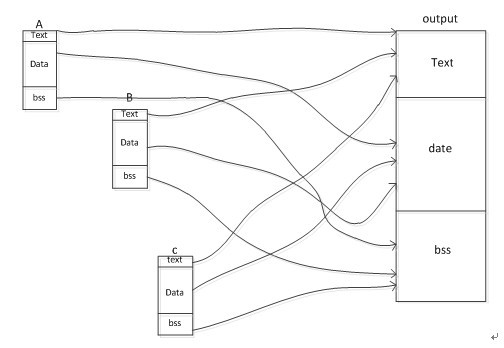

下面是一些可能更合适的解释。

以下描述出于[GNU Binutils (sourceware.org)](https://sourceware.org/binutils/)：

> ​	Every link is controlled by a linker script. This script is written in the linker command language.
>
> ​    The main purpose of the linker script is to describe how the sections in the input files should be mapped into the output file, and to control the memory layout of the output file. Most inker scripts do nothing more than this.

以下描述出于《[程序员的自我修养 (豆瓣) (douban.com)](https://book.douban.com/subject/3652388/)》：

>   如果把整个链接过程比作一台计算机，那么ld链接器就是计算机的`CPU`，所有的目标文件、库文件就是输入，链接结果输出的可执行文件就是输出，而链接控制脚本正是这台计算机的“程序”，它控制CPU的运行，以“程序”要求的方式将输入加工成所须要的输出结果。链接控制脚本“程序”使用一种特殊的语言写成，即`ld`的链接脚本语言，这种语言并不复杂，只有为数不多的几种操作。无论是输出文件还是输入文件，它们的主要的数据就是**文件中的各种段**，我们把输入文件中的段称为**输入节（Input Sections）**，输出文件中的段称为**输出节（Output Sections）**。简单来讲，**控制链接过程无非是控制输入节如何变成输出节**，比如哪些输入节要合并一个输出节，哪些输入节要丢弃；指定输出节的名字、装载地址、属性，等等。（一般链接脚本名都以`lds`作为扩展名`ld script`）。

在研究链接脚本之间，最好对程序的编译和链接需要有一定的了解。

以下，基于STM32H750XBHx的一个链接脚本文件作分析，其他的芯片大同小异，可以根据参阅[Top (LD) (sourceware.org)](https://sourceware.org/binutils/docs/ld/index.html)。

```assembly
/*
 * linker script for STM32H750XBHx with GNU ld
 */
```

## 3.0 基本概念

链接脚本将输入文件合并为单个输出文件（`.exe`，`.bin`，`.elf`等等）。输出文件和每个输入文件采用的是一种被称为**目标文件格式**的特殊数据格式。

**每个文件都是一个目标文件**。**输出文件通常被称为可执行文件，但也可以称为目标文件**。

此外，**每个目标文件都有一个节列表（`a list of sections`）**，有时我们将**输入文件的一个节称为输入节（`input section`，如何将输入文件映射到内存布局中）**，类似地，**输出文件的一个节称为输出节（`input section`，最终的可执行文件在内存中是如何布局的）**。

**目标文件的每个节都有一个节名和节大小**。大多数节也有一个相关的数据块，称为**节内容**。一个节可以被标记为**可加载的**，这意味着当输入文件运行时，节内容应该被加载到内容中。没有内容的节可以是**可分配的**，这意味着内存中的一个区域应该被留出，但不应该在该内存区域加载特别的内容（在某些情况下，内存必须被清零）。既可以**不加载也可以不分配**的节，通常包含了某种调试信息（`debugging information`）。

每个可加载或可分配的输出节都有两个地址。第一个是**`VMA`或虚拟内存地址**，这是运行输出文件时，节将具有的地址。第二个是**`LMA`或加载内存地址**，这是将加载节的地址。在大多数情况下，这两个地址是相同的（如PC机上）。一个不同的情况是，当一个数据节被加载到`ROM`中，然后在程序启动时被复制到`RAM`（这种技术通常用于初始化基于`ROM`的系统的全局变量，如MCU上）。在这种情况下，`ROM`的地址为`LMA`，而`RAM`的地址为`VMA`。

通过使用带有`-h`选项的`objdump`程序，可以查看目标文件中的节。

每个目标文件也有一个符号列表，称为符号表（`symbol table`）。符号可以是定义的，也可以是未定义的。每个符号都有一个名称，每个定义的符号都有地址等信息。如果将一个`C`或`C++`程序**编译**成一个目标文件，那么每一个定义的函数和全局变量或静态变量都将获得一个定义的符号。输入文件中引用的每个未定义函数或全局变量都将成为一个未定义的符号。

可以使用`nm`程序或通过带有`-t`选项的`objdump`程序来查看目标文件中的符号。

> 关于LMA和VMA可以参考这个链接：[详解LMA & VMA 【转】 · Issue #887 · cisen/blog (github.com)](https://github.com/cisen/blog/issues/887)
>
> [VMA vs LMA? (embeddedrelated.com)](https://www.embeddedrelated.com/showthread/comp.arch.embedded/77071-1.php)

## 3.1 常用特殊符号

### 3.1.1 `.`

位置计数器，如果没有使用其他方式来定义输出节（`output section`）的地址，地址就会被设置为位置计数器的值。

位置计数器按输出节的大小递增，在`"SECTION"`命令的开头，位置计数器的值为`"0"`。

### 3.1.2 `*`

与任何文件名匹配的通配符，`*(.text)` 表示所有输入文件中的`.text`输入节。

## 3.2 常用关键字

### 3.2.1 `MEMORY`

```
MEMORY
  {
    name [(attr)] : ORIGIN = origin, LENGTH = len
    …
  }
```

**链接器默认配置允许分配所有可用的内存**，通过`MEMORY`命令可以重载相应的内存。

**`MEMORY`命令描述了目标的内存块的位置和大小**，可以使用`MEMORY`命令来描述哪些内存区域可以使用，哪些内存区域应该避免使用。可以给特定的内存区域分配节。链接器基于内存区域设置节地址，如果区域趋于饱和将会产生警告信息。链接器不会为了适应可用区域而打乱节的顺序。

**一个链接脚本可能包含多个`MEMORY`命令，但所有定义的内存块都被视为是在单个`MEMORY`命令中定义的。**

`NAME`是链接脚本用来引用相应内存区域的名字。区域名称在链接脚本外部没有任何意义。区域名被存储在一个独立的名字空间，且不会与符号名，文件名，或者节名起冲突。每个内存区域必须在`MEMORY`命令中有一个不同的名字。但是你此后可以使用`REGION_ALIAS`命令为已存在的内存区域添加别名。 

`ATTR`字符是一个可选的属性列表，用来决定是否为一个脚本中没有显式指定映射的输入节使用一个特定的内存区域。就像`SECTIONS`中进行过的说明，如果不为一个输入节指定一个输出节，链接器将会创建一个与输入节同名的输出节。如果定义了区域属性，链接器会使用他们来决定创建的输出节存放的内存区域。

`ATTR`字符串只能使用下面的字符组成：

1. `"R"`只读节
2. `"W"`读写节
3. `"X"`可执行节
4. `"A"`可分配节
5. `"I"`已初始化节
6. `"L"`类似于`"I"`
7. `"!"`反转其后面的所有属性

如果一个未映射的节与除`"!"`外任意列出的属性匹配，它会被放置在内存区域中。`"!"`属性翻转对后面字符的测试，一个未映射的节与`"!"`后列出的任意属性不匹配时，它才会被放置在内存中。因此属性`"RW!X"`将匹配任何具有`"R"`或`"W"`属性但不具有`"X"`属性的未映射的节。

`ORIGIN`是一个表达式，代表了内存区域的起始地址。表达式的结果必须等价于一个常量并且不能含有任何符号。关键字`ORIGIN`缩短为`org`或者`o`（但不能写成`ORG`）。

`LEN`是一个表达式，用来表示内存区域的字节数大小。类似于`ORIGIN`表达式，表达式的结果必须等价于一个常量并且不能含有任何符号。关键字`LENGTH`可以被缩写为`len`或者`l`。

以下是一个实例，我们指定了两个内存区域可以分配：一个从`"0"`开始，分配256KB，一个从`"0x40000000"`，分配4MB。

链接器会将每个非显式映射到具体内存区域的节放入`rom`内存区域中，并且这些节必须是只读的或可执行的。链接器会将其他未显式映射到具体内存区域的节放入`ram`内存区域中，并且这些节是不可只读且不可执行的。

```c
MEMORY
  {
    rom (rx)  : ORIGIN = 0, LENGTH = 256K
    ram (!rx) : org = 0x40000000, l = 4M
  }
```

**一旦定义了内存区域，就可以使用使用`>region`指令输出节属性来指导链接器将特定的输出节放入具体的内存区域中。**

例如，如果有一个内存区域名为`mem`，则可以在输出节定义中使用`>mem`。如果没有为输出节指定地址，链接器会将地址设置为内存区域中的下一个可用地址。如果指向内存区域的组合输出节对相应内存区域来说太大了的话，链接器会发出错误消息。

可以通过`ORIGIN(memory)`和 `LENGTH(memory)`函数来获取一个表达式中内存的起始地址和内存长度。

```
_fstack = ORIGIN(ram) + LENGTH(ram) - 4;
```

### 3.2.2 `ENTRY`

```
ENTRY(symbol)
```

在一个程序中最先被执行的指令称为入口点（`entry point`）。

使用`ENTRY`命令可以设置入口点。

设置入口点的方式不止`ENTRY`命令一种，链接器会按照顺序，尝试以下几种方式来设置入口点，并在其中一个成功时停止：

1.  `-e`入口命令行选项；
2.  链接脚本中的`ENTRY(symbol)`命令；
3.  目标特定符号的值（如果已经定义），对绝大多数目标来说，符号为`start`，但对PE-和基于BeOS的系统来说，可能需要检查可能的输入符号列表，并与找到的第一个符号匹配；
4.  代码节的第一个字节的地址，如果存在并且正在创建一个可执行文件，代码节通常是`.text`，但也可以是其他符号；
5.  地址0x0。

### 3.2.3 `SECTION`

```
SECTIONS
{
  sections-command
  sections-command
  …
}
```

`SECTION`命令告知链接器如何将输入节的内容映射到输出节中，以及如何在内存放放置输出节。

每个`sections-command`可以是以下的其中之一：

- `ENTRY`命令（see [Entry command](https://sourceware.org/binutils/docs/ld/Entry-Point.html)）
- 符号赋值语句(see [Assigning Values to Symbols](https://sourceware.org/binutils/docs/ld/Assignments.html))
- 输出节的描述
- 覆盖描述（`overlay description`）

其中，为了方便在这些命令中使用位置计数器`.`，可以在`SECTION`命令中使用`ENTRY`命令和符号赋值语句。因为可以在输出文件的布局中有意义的位置使用这些名，使得链接脚本更容易理解。

#### 3.2.3.1 输出节描述

对于一个输出节的完整描述如下。

```
section [address] [(type)] :
  [AT(lma)]
  [ALIGN(section_align) | ALIGN_WITH_INPUT]
  [SUBALIGN(subsection_align)]
  [constraint]
  {
    output-section-command
    output-section-command
    …
  } [>region] [AT>lma_region] [:phdr :phdr …] [=fillexp] [,]
```

大多数输出节并不需要用到绝大多数可选的节属性（参数）。

**语法要求**：

- 节周围的空格是必须的，以保证节名明确无误；
- 冒号和大括号是必需的；
- 如果使用了`fillexp`，并且后一个`sections-command`像是表达式的延续，那么结尾处的逗号`","`可能是需要的；
- 换行符和其他空格是可选的。

每个`output-section-command` 可以是以下的其中之一：

- 符号赋值语句(see [Assigning Values to Symbols](https://sourceware.org/binutils/docs/ld/Assignments.html))
- 输入节描述（see [Input Section Description](https://sourceware.org/binutils/docs/ld/Input-Section.html)）
- 直接包含的数据值（see [Output Section Data](https://sourceware.org/binutils/docs/ld/Output-Section-Data.html)）
- 特定的输出节**关键字**(see [Output Section Keywords](https://sourceware.org/binutils/docs/ld/Output-Section-Keywords.html))

#### 3.2.3.2 输出节名（必选）

`section`是输出节的名字，`section`必须满足输出的格式要求。在只支持有限数量的节的格式中，例如`a.out`，节名必须是该格式支持的名称之一（例如，`a.out`只支持`.text`，`.bss`和`.data`这三种名称）。如果输出格式支持任意数量的节，包含数字而不是名称（Oasys就是如此），节名则应作为带引号的数字字符串提供。节名可以由任意字符序列组成，但必须包含任何异常字符（如逗号`","`）的名称必须使用引号。

输出节名`"/DISCARD/"`是特殊的。[Output Section Discarding](https://sourceware.org/binutils/docs/ld/Output-Section-Discarding.html)

#### 3.2.3.3 输出节地址（可选）

`address`是输出节的`VMA`（虚拟存储器地址）的一个表达式。该地址是可选的，但如果提供了该地址，那输出地址将完全按照指定的设置。

如果未指定输出地址，那么将按照几种的启发式（对照的）方法中的为该部分选择一个输出地址，该地址将进行调整，以符合输出节的对齐要求，对齐要求是输出节中包含的任何输入部分的最严格对齐方式。

设置输出节地址的启发式方法如下：

- 如果为该节设置了输出内存区域，则将其添加至该区域，其地址为该区域内的下一个空闲地址；
- 如果`MEMORY`命令已经用于创建内存区域列表，那么选择与该节有匹配的属性的第一个区域来容纳该节，该节的输出地址将是该区域中的下一个空闲地址；[MEMORY Command](https://sourceware.org/binutils/docs/ld/MEMORY.html)
- 如果没有指定内存区域，或者没有匹配该节的内存区域，那么输出地址将基于位置计数器的当前值。

例如，一下两条命令只有微妙的不同，第一条命令会设置`.text`的输出节的地址到位置计数器的当前值，第二条指令会将`.text`的输出节的地址设置为位置计数器的当前值，该值与任何`.text`输入节中的最严格对齐方式的地方对齐。（The second will set it to the current value of the location counter aligned to the strictest alignment of any of the ‘.text’ input sections.）

```
.text . : { *(.text) }

.text : { *(.text) }
```

地址可以是任意表达式（ [Expressions in Linker Scripts](https://sourceware.org/binutils/docs/ld/Expressions.html)）。比如，如果想要将一个节对齐到0x10字节边界上，使节地址的最低四位为0，可以执行以下操作。

```
.text ALIGN(0x10) : { *(.text) }
```

`ALIGN`返回向上对齐到指定值的当前位置计数器。如果节为非空，则为节指定地址会改变位置计数器的值。（空节会被忽略）

#### 3.2.3.4 输入节描述（必选）output-section-command

**最常见的`output-section-command`命令是输入节描述。输入节描述是最基本的链接脚本操作。**

**通过输出节告知链接器如何在内存中布局程序。可以使用输入节描述来告知链接器如何将输入的文件映射到内存布局中。**

##### 3.2.3.4.1 输入节基础（Input Section Basics）

一个输入节描述包括了一个可选的文件名以及其后的括号中的节名列表。

文件名和节名可以是通配符模式，我们可以在 [Input Section Wildcard Patterns](https://sourceware.org/binutils/docs/ld/Input-Section-Wildcards.html)中进一步描述。

最常用的输入节描述是在输出节中包含具有特定名称的所有输入端，例如，包含所有`.text`节部分，可以这么写

```
*(.text)

//`*`表示与任何文件名匹配的通配符。
```

为了排除与文件名通配符的匹配的文件列表，可以使用`EXCLUDE_FILE`命令来匹配除了`EXCLUDE_FILE`列表中指定的文件以外的所有文件。例如：

```
EXCLUDE_FILE (*crtend.o *otherfile.o) *(.ctors)
```

将导致包含除`crtend.o`和`otherfile.o`之外所有文件中的所有`.ctors`节。

结果与之前的示例相同。如果节列表包含不止一个节，那么使用`EXCLUDE_FILE`的两种语法会非常有用，如下描述。

包含超过一个节的方式有两种。

```
*(.text .rdata)
*(.text) *(.rdata)
```

他们之间的区别**在于`.text`与`.rdata`的输入节出现在输出节中的顺序**。在第一个示例中，他们会混合在一起，出现的顺序与链接器输入过程中被发现的顺序相同。在第二个示例中，所有的`.text`输入节会先出现，然后才是`.rdata`。

对多个节使用`EXCLUDE_FILE`命令，如果排除在节列表内，则排除仅适用于下一个紧跟的节，例如：

```
*(EXCLUDE_FILE (*somefile.o) .text .rdata)
```

会导致除`somefile.o`外的所有文件中的`.text`节会被包含，而包含`somefile.o`在内的所有文件中的`.rdata`节也会被包含。排除来自某个文件（`somefile.o`）中的`.rdata`节，示例可以修改为以下格式：

```
*(EXCLUDE_FILE (*somefile.o) .text EXCLUDE_FILE (*somefile.o) .rdata)
```

或者，在选择输入文件前，将`EXCLUDE_FILE`命令放在节列表外，将导致排除适用于所有节。示例可以修改为以下格式：

```
EXCLUDE_FILE (*somefile.o) *(.text .rdata)
```

也可以指定一个文件名来包含一个具体文件中的节。如果一个或更多个文件中包含需要存放在内存中特定区域中的特殊数据，可以采取这种方式。如下：

```
data.o(.data)
```

为了根据输入节的节标志来细化包含的节，可以使用`INPUT_SECTION_FLAGS` 命令。

下面是一个为`ELF`节使用节标题标志的简单实例：

```
SECTIONS {
  .text : { INPUT_SECTION_FLAGS (SHF_MERGE & SHF_STRINGS) *(.text) }
  .text2 :  { INPUT_SECTION_FLAGS (!SHF_WRITE) *(.text) }
}
```

在本例中，输出节`.text`由任意与名称`*(.text)`匹配的输入节组成，该输入节的节标题标志`SHF_MERGE`和`SHF_STRINGS`已设置。输出节`.text2`由任意与名称`*(.text)`匹配的输入节组成，其节标题标志`SHF_WRITE`已被清除。

> 以下还有一些部分此处不做解释，对我们这里的内容没有太大影响。
>
> 可以看这个链接：[Input Section Basics (LD) (sourceware.org)](https://sourceware.org/binutils/docs/ld/Input-Section-Basics.html)

##### 3.2.3.4.2 输入节通配符模式

在一个输入节描述中，文件名或节名都可以是通配符模式。

在以上许多示例中，可以看到`*`的文件名是一个简单的文件名通配符模式，通配符模式与在Unix Shell中使用的模式类似。

------

**`*`**

匹配任意数量的字符。

**`?`**

匹配任意单个字符。

**`[chars]`**

匹配任意字符的单个实例，`-`字符可用于指定字符范围，如`[a-z]`可以匹配任意小写字母。

**`\`**

引用（用引号······扩起？）以下字符。

------

> 中间还有一些部分此处不做解释，对我们这里的内容没有太大影响。
>
> 可以看这个链接：[Input Section Wildcards (LD) (sourceware.org)](https://sourceware.org/binutils/docs/ld/Input-Section-Wildcards.html)

如果对输入节的去向感到困惑，可以使用链接器选项`-M`来生成映射文件（`.map`），映射文件精确地显示了如何将输入节映射到输出节。

以下的示例和在哪个，显示了通配符模式如何对文件进行分区。此链接器脚本指示链接器放置所有的`.text`节到`.text`，所有的`.bss`节到`.bss`。链接器会将所有文件中以大写字母开头的`.data`节放置在`.DATA`中。对于其他文件，链接器将放置`.data`节到`.data`。

```
SECTIONS {
  .text : { *(.text) }
  .DATA : { [A-Z]*(.data) }
  .data : { *(.data) }
  .bss : { *(.bss) }
}
```

##### 3.2.3.4.3 通用符号（common symbols）输入节

通用符号需要特殊的符号，因为在许多目标文件格式中，通用符号并没有特定的输入节。**链接器将通用符号视为位于名为`COMMON`的输入节中。**

可以将文件名与`COMMON`节一起使用，就像使用其他输入节一样，可以使用此选项将特定文件中的通用符号放置在一个节中，而其他输入文件的通用符号则放置在另一节中。

在绝大多数情况下，输入文件的通用符号放置在输出文件的`.bss`节中。例如：

```
.bss { *(.bss) *(COMMON) }
```

某些目标文件格式具有多种类型的通用符号。例如，`MIPS ELF`目标文件格式区分标准通用符号和小型通用符号。在这种情况下，链接器会为其他类型的通用符号使用不同的特殊节名。在`MIPS ELF`的情况下，链接器使用`COMMON`作为标准通用符号，使用`scommon`作为小型通用符号。这允许将不同类型的通用符号映射到不同位置的内存中。

有时，可以在旧的链接器脚本中看到`[COMMON]`，这种符号已经过时，相当于`*(COMMON)`。

##### 3.2.3.4.4 输入节和垃圾收集（Input Section and Garbage Collection）

当链接过程垃圾收集（`--gc-sections`）被使用时，标记不应删除的节通常很有用。这是通过使用`KEEP()`包围输入节的通配符入口来实现的，如：

```
KEEP(*(.init))
KEEP(SORT_BY_NAME(*)(.ctors))
```

##### 3.2.3.4.5 输入节例程

以下示例是一个完整的链接器脚本。

这个脚本告知链接器从文件`all.o`中读取所有的节，并将他们放置在从地址`0x10000`节开始的输出节`outputa`的开始处。在相同的输出节内，紧跟的是来自`foo.o`文件中的所有`.input1`节。来自`foo.o`文件中的所有`.input2`节存入输出节`outputb`中，后面的是来自`foo1.o`文件中的所有`.input1`节。所有的来自任意文件的剩余的`.input1`节和`.input2`节被写入到输出节`outputc`。

```
SECTIONS {
  outputa 0x10000 :
    {
    all.o
    foo.o (.input1)
    }
  outputb :
    {
    foo.o (.input2)
    foo1.o (.input1)
    }
  outputc :
    {
    *(.input1)
    *(.input2)
    }
}
```

如果输出节和输入节的名称相同，并可以用C标识符表示，那么链接器将自动发现`PROVIDE`的两个符号：`__start_SECNAME`和`__stop_CNAME`，其中`SECNAME`是节的名称。它们分别知识输出节的起始地址和结束地址。

> 注：大多数节名不能表示为C标识符，因为他们包含`"."`字符。

#### 3.2.3.5 输出节数据（可选，[Output Section Data](https://sourceware.org/binutils/docs/ld/Output-Section-Data.html)）

暂不解释。

#### 3.2.3.6 输出节关键字（可选，[Output Section Keywords](https://sourceware.org/binutils/docs/ld/Output-Section-Keywords.html)）

暂不解释。

#### 3.2.3.7 输出节丢弃（可选，[Output Section Discarding](https://sourceware.org/binutils/docs/ld/Output-Section-Discarding.html)）

暂不解释。

#### 3.2.3.8 输出节属性（可选，[Output Section Attributes](https://sourceware.org/binutils/docs/ld/Output-Section-Attributes.html)）

一个完整的输出节描述如下：

```
section [address] [(type)] :
  [AT(lma)]
  [ALIGN(section_align) | ALIGN_WITH_INPUT]
  [SUBALIGN(subsection_align)]
  [constraint]
  {
    output-section-command
    output-section-command
    …
  } [>region] [AT>lma_region] [:phdr :phdr …] [=fillexp]
```

在上面的内容已经描述了`section`，`address`和`output-section-command`，下面对其他内容进行描述。

##### 3.2.3.8.1 输出节类型（`type`）

每一个输出节都有一个类型，也就是关键字`type`，定义了以下类型：

1. `NOLOAD`：该节被标记为**不可加载**，以保证在程序运行过程中不会被加载到内存中。
2. `READONLY`：该节被标记为**只读**。
3. `DESCT`：
4. `COPY`：
5. `INFO`：
6. `OVERLAY`：这些类型名用于向后（`backward`）兼容，很少使用，具有相同的效果，即该节应标记为**不可分配**，程序运行过程中也不会为该节分配内存。
7. `TYPE = type`：设置节类型为整型`type`。在生成`ELF`输出文件，类型名称`SHT_PROGBITS`，`SHT_STRTAB`，`SHT_NOTE`， `SHT_NOBITS`，`SHT_INIT_ARRAY`, `SHT_FINI_ARRAY`，和`SHT_PREINIT_ARRAY`也可以用于`type`。用户有责任确保节类型的任意特殊要求得到满足。
8. `READONLY ( TYPE = type )`：这个语句形式通过`type`将`READONLY`类型和类型指定结合在一起。

**链接器通常按照映射到输出节的输入节的属性设置输出节的属性，可以通过使用节类型来重载这个过程。**例如，在以下的脚本示例中，`ROM`节位于内存地址`0`处，且不需要在程序运行过程中被载入。

```
SECTIONS {
  ROM 0 (NOLOAD) : { … }
  …
}
```

##### 3.2.3.8.2 输出节`LMA`

每个节都有一个虚拟地址（`VMA`）和一个加载地址（`LMA`）（ [Basic Linker Script Concepts](https://sourceware.org/binutils/docs/ld/Basic-Script-Concepts.html)）。`VMA`可以参考 [Output Section Address](https://sourceware.org/binutils/docs/ld/Output-Section-Address.html) ，也可以参考`1.3.3`节。**`LMA`通常由`AT`和`AT>`关键字指定。**是否指定`LMA`是可选的。

`AT`关键字将表达式作为参数，这指定了节的确切加载地址。`AT>`关键字以内存区域的名称作为参数（[MEMORY Command](https://sourceware.org/binutils/docs/ld/MEMORY.html)），节的加载地址设置为区域内下一个空闲地址，按节的对齐要求对齐。

如果未为可分配部分指定`AT`和`AT>`，链接器会使用以下的启发式方法来决定`LMA`：

1. 如果该节具有特定的`VMA`地址，那么这也用作`LMA`地址；
2. 如果该节不可分配，那么其`LMA`被设置为`VMA`；
3. 否则，如果可以找到与当前节兼容的存储器区域，并且该区域包含至少一个节，则`LMA`被设置为使得`VMA`和`LMA`之间的差异与定位区域中的最后一个节的`VMA`和`LMA`之间的差异相同；（Otherwise if a memory region can be found that is compatible with the current section, and this region contains at least one section, then the LMA is set so the difference between the VMA and LMA is the same as the difference between the VMA and LMA of the last section in the located region.）
4. 如果没有声明内存区域，则使用在上一步中覆盖整个地址空间的默认区域；
5. 如果没有找到合适的区域，或者没有找到先前的节，那么`LMA`被设置为等于`VMA`。

这个功能旨在使构建`ROM`映像更容易。例如，以下链接器脚本创建三个输出节：一个名为`.text`的节，开始于`0x1000`，一个名为`.mdata`的节，在`.text`节的末尾加载，即使它的`VMA`是`0x2000`，一个名为`.bss`的节，保存地址`0x3000`处的未初始化数据。符号`_data`由值`0x2000`定义，表明了位置计数器保存`VMA`的值，而不是`LMA`的值。

```
SECTIONS
  {
  .text 0x1000 : { *(.text) _etext = . ; }
  .mdata 0x2000 :
    AT ( ADDR (.text) + SIZEOF (.text) )
    { _data = . ; *(.data); _edata = . ;  }
  .bss 0x3000 :
    { _bstart = . ;  *(.bss) *(COMMON) ; _bend = . ;}
}
```

与使用此链接器脚本生成的程序一起使用的运行时间的初始化代码将包括以下内容，以将初始化数据从`ROM`映像中复制到它运行时间的地址。注意此代码如何利用链接器脚本定义的符号。

```c
extern char _etext, _data, _edata, _bstart, _bend;
char *src = &_etext;
char *dst = &_data;

/* ROM has data at end of text; copy it.  */
while (dst < &_edata)
  *dst++ = *src++;

/* Zero bss.  */
for (dst = &_bstart; dst< &_bend; dst++)
  *dst = 0;

```

##### 3.2.3.8.3 强制输出对齐（`ALIGN`）

可以使用`ALIGN`指令来增加一个输出节的对齐方式。作为替代方案，可以使用`ALIGN_WITH_INPUT`属性来强制在整个输出节中的`VMA`和`LMA`之间的差异保持不变。

##### 3.2.3.8.4 强制输入对齐（`SUBALIGN`）

可以使用`SUBALIGN`在输出节中强制输入节对齐。指定的值将覆盖输入节给定的任何对齐方式，无论是较大还是较小。

##### 3.2.3.8.5 输出节约束（`constraint`）

通过分别使用关键字`ONLY_IF_RO`和`ONLY_IF_RW`，可以指定仅当输出节的所有输入节都是只读的或所有输入部分是读写的时才创建输出节。

##### 3.2.3.8.6 输出节区域（`>region`）

可以使用`>region`将节分配给先前定义的内存区域。See [MEMORY Command](https://sourceware.org/binutils/docs/ld/MEMORY.html).

此处有一个例子：

```
MEMORY { rom : ORIGIN = 0x1000, LENGTH = 0x1000 }
SECTIONS { ROM : { *(.text) } >rom }
```

##### 3.2.3.8.7 输出节Phdr（`:phdr`）

可以使用`:phdr`将节分配给之前定义的程序节。See [PHDRS Command](https://sourceware.org/binutils/docs/ld/PHDRS.html).

如果一个节被分配给一个或多个部分，则所有后续分配的节也将分配给那些部分，除非它们显式使用了`:phdr`修饰符。可以使用`:NONE`告诉链接器不要将节任何部分中。

下面是一个简单的例子：

```
PHDRS { text PT_LOAD ; }
SECTIONS { .text : { *(.text) } :text }
```

##### 3.2.3.8.8 输出节填充（`=fillexp`）

可以使用`=fillexp`设置整个节的填充方式，`fillexp`是一个表达式（see [Expressions in Linker Scripts](https://sourceware.org/binutils/docs/ld/Expressions.html)）。输出节中任何其他未指定的内存区域（例如，由于输入节需要对齐而留下的间隙）将填充该值，必要时重复该值。如果填充表达式是一个简单的十六进制表达式，即以`0x`开头的十六进制数字字符串，并且后面没有`k`或`M`，则可以使用任意长的十六进制序列来指定填充方式；前导的零也成为方式的一部分。对于其他所有情况，包括额外的括号或一个一元的`+`，填充方式是表达式值的四个最低有效字节。在所有情况下，数字都是大端结构。

此外，也可以使用`output section commands`中的`FILL `命令更改填充值。（see [Output Section Data](https://sourceware.org/binutils/docs/ld/Output-Section-Data.html)）

下面是一个简单的例子：

```
SECTIONS { .text : { *(.text) } =0x90909090 }
```

#### 3.2.3.9 覆盖说明（可选，Overlay Description）

一个覆盖描述提供了一种简单的方式，来描述作为单个存储器映像的一部分被加载但将在同一存储器地址运行的节。在运行时，某种类型的覆盖管理器会根据需要将覆盖的部分从运行时的内存地址复制进去或复制出来，可能只需要简单地操作寻址位。例如当内存的某个区域比另一个区域快时，这种方法就会很有用。

使用`Overlay`命令来描述覆盖。`Overlay`命令在`SECTIONS`命令中使用，与输出节描述类似。`Overlay`命令的完整语法如下：

```
OVERLAY [start] : [NOCROSSREFS] [AT ( ldaddr )]
  {
    secname1
      {
        output-section-command
        output-section-command
        …
      } [:phdr…] [=fill]
    secname2
      {
        output-section-command
        output-section-command
        …
      } [:phdr…] [=fill]
    …
  } [>region] [:phdr…] [=fill] [,]
```

除了`Overlay`（关键字）外，所有的内容都是可选的，并且每个节都必须有一个名称（如`secname1`和`secname2`）。`Overlay`结构中的节定义与通常的`SECTIONS`结构中的定义相同(see [SECTIONS Command](https://sourceware.org/binutils/docs/ld/SECTIONS.html))，除了一点，`Overlay`中的节不能定义地址和内存区域。

如果使用了填充，并且`sections-command`命令看起来像表达式的延续（？），则可能需要结尾处的逗号（`,`）。（The comma at the end may be required if a fill is used and the next sections-command looks like a continuation of the expression.）

这些节都是使用相同的起始地址定义的。这些节的`LMA`的排列应使其在内存中从用于整个`Overlay`的加载地址开始连续（与正常的节定义一样，加载地址是可选的，默认是起始地址；起始地址也是可选，并且默认为位置计数器的当前值）。

如果使用了`NOCROSSREFS`关键字，并且节之间存在任何引用，链接器将报告错误。由于这些节都在同一地址运行，因此一个节直接引用另一个节通常没有意义。（See [NOCROSSREFS](https://sourceware.org/binutils/docs/ld/Miscellaneous-Commands.html).）

对于`OVERLAY`中的每个节，链接器会自动提供两个符号。符号`__load_start_secname`定义为节的起始加载地址。符号`__load_stop_secname`定义为节的最终加载地址。`secname`中任何在`C`标识符中不合法的字符都将被删除。`C`（或汇编程序）代码可以根据需要使用这些符号来移动重叠的部分。

在覆盖结束时，位置计数器的值设置为覆盖的起始地址加上最大部分的大小。

这里有一个例子。请记住，这将出现在`SECTIONS`结构中。

```
  OVERLAY 0x1000 : AT (0x4000)
   {
     .text0 { o1/*.o(.text) }
     .text1 { o2/*.o(.text) }
   }
```

这定义了从地址`0x1000`开始的`.text0`和`.text1`。`.text0`会被加载到地址`0x4000`，而`.text1`将被加载到`.text0`后。如果被引用，将定义以下符号：`__load_start_text0`, `__load_stop_text0`, `__load_start_text1`, `__load_stop_text1`。

将覆盖`.text1`复制到覆盖区域的C代码可能如下所示。

```c
  extern char __load_start_text1, __load_stop_text1;
  memcpy ((char *) 0x1000, &__load_start_text1,
          &__load_stop_text1 - &__load_start_text1);
```

> 注：`OVERLAY`命令只是语法糖，因为它所做的一切都可以使用更基本的命令来完成。上面的例子可以写成如下。

```
  .text0 0x1000 : AT (0x4000) { o1/*.o(.text) }
  PROVIDE (__load_start_text0 = LOADADDR (.text0));
  PROVIDE (__load_stop_text0 = LOADADDR (.text0) + SIZEOF (.text0));
  .text1 0x1000 : AT (0x4000 + SIZEOF (.text0)) { o2/*.o(.text) }
  PROVIDE (__load_start_text1 = LOADADDR (.text1));
  PROVIDE (__load_stop_text1 = LOADADDR (.text1) + SIZEOF (.text1));
  . = 0x1000 + MAX (SIZEOF (.text0), SIZEOF (.text1));
```

### 3.2.4 `PROVIDE`

参考：[PROVIDE (LD) (sourceware.org)](https://sourceware.org/binutils/docs/ld/PROVIDE.html)

在某些情况下，仅在符号被引用且未被链接中包含的任何对象定义时，链接器脚本才需要定义符号。例如，传统链接器定义了符号`etext`。而`ANSI C`中要求用户能够使用`etext`作为函数名，而且不会遇到错误。`PROVIDE`关键字只能用于定义符号，如`etext`，但前提是它被引用但未被定义。语法是：

```
PROVIDE(symbol = expression)
```

下面是使用`PROVIDE`定义`etext`的示例：

```
SECTIONS
{
  .text :
    {
      *(.text)
      _etext = .;
      PROVIDE(etext = .);
    }
}
```

在本例中，如果程序中定义了`_etext`（带前导下划线），链接器将给出一个多定义诊断提示。另一方面，如果程序中定义了`etext`（不带前导下划线），链接器将在程序中无声地使用该定义。如果程序引用了`etext`，但没有定义`etext`，链接器将会使用链接器脚本中地定义。

> 注：`PROVIDE`指令认为要定义通用符号，即使这样的符号可以与`PROVIDE`指令将创建的符号组合。当考虑析构函数和析构函数列表符号（如`__CTOR_LIST__`）时，这一点尤为重要，因为它们通常被定义为通用符号。

## 3.3 指定ROM和RAM

> 如果需要使用外部存储器，如需要XIP和BootRom之类的功能，我们也需要设置存储Bank的区域和大小。

```assembly
MEMORY
{
    ROM (rx) : ORIGIN =0x08000000,LENGTH =128k
    RAM (rw) : ORIGIN =0x24000000,LENGTH =512k
}
```

## 3.4 指定程序入口

将符号`Reset_Handler`设置为入口地址，入口地址是进程执行的第一条指令在进程地址空间的地址，`ENTRY(Reset_Handler)`表示程序最开始从复位中断服务函数处开始执行。Reset_Handler定义在startup_stm32f407xx.s启动文件中。

```
ENTRY(Reset_Handler)
```

## 3.5 指定堆栈大小

```
_system_stack_size = 0x200;
```

指定栈大小，并结合后面的节的定义，设置栈顶和栈底。

此处由于使用的是RTT，因此多余的RAM会被内存堆管理器管理，无需分配堆。

## 3.6 指定各个节定义

以下是完整的段定义。

```assembly
SECTIONS
{
    .text :								/* 输出节名 */
    {
        . = ALIGN(4);					/* 四字节对齐, 位置计数器对齐到下一个对齐边界 */
        _stext = .;						/* 记录.text节的开始位置 */
        KEEP(*(.isr_vector))            /* Startup code, 标记.isr_vector节的内容不应被消除，避免被编译器优化，
        									同时向量表放在.text段最开始的位置 */

        . = ALIGN(4);					
        *(.text)                        /* remaining code, 将匹配的输入节放入输出节中 */
        *(.text.*)                      /* remaining code */
        *(.rodata)                      /* read-only data (constants) */
        *(.rodata*) 
        *(.glue_7)
        *(.glue_7t)
        *(.gnu.linkonce.t*)

        /* section information for finsh shell */
        . = ALIGN(4);
        __fsymtab_start = .;
        KEEP(*(FSymTab))
        __fsymtab_end = .;

        . = ALIGN(4);
        __vsymtab_start = .;
        KEEP(*(VSymTab))
        __vsymtab_end = .;

        /* section information for utest */
        . = ALIGN(4);
        __rt_utest_tc_tab_start = .;
        KEEP(*(UtestTcTab))
        __rt_utest_tc_tab_end = .;

        /* section information for at server */
        . = ALIGN(4);
        __rtatcmdtab_start = .;
        KEEP(*(RtAtCmdTab))
        __rtatcmdtab_end = .;
        . = ALIGN(4);

        /* section information for initial. */
        . = ALIGN(4);
        __rt_init_start = .;
        KEEP(*(SORT(.rti_fn*)))
        __rt_init_end = .;

        . = ALIGN(4);

        PROVIDE(__ctors_start__ = .);			/* 提供__ctors_start__符号 */
        KEEP (*(SORT(.init_array.*)))
        KEEP (*(.init_array))
        PROVIDE(__ctors_end__ = .);

        . = ALIGN(4);

        _etext = .;								/* 记录.text节的结束地址 */
    } > ROM = 0									/* .text节存入ROM */

    /* .ARM.exidx is sorted, so has to go in its own output section.  */
    __exidx_start = .;
    .ARM.exidx :
    {
        *(.ARM.exidx* .gnu.linkonce.armexidx.*)

        /* This is used by the startup in order to initialize the .data secion */
        _sidata = .;
    } > ROM
    __exidx_end = .;

    /* .data section which is used for initialized data */

    .data : AT (_sidata)
    {
        . = ALIGN(4);
        /* This is used by the startup in order to initialize the .data secion */
        _sdata = . ;

        *(.data)
        *(.data.*)
        *(.gnu.linkonce.d*)


        PROVIDE(__dtors_start__ = .);
        KEEP(*(SORT(.dtors.*)))
        KEEP(*(.dtors))
        PROVIDE(__dtors_end__ = .);

        . = ALIGN(4);
        /* This is used by the startup in order to initialize the .data secion */
        _edata = . ;
    } >RAM

    .stack : 
    {
        . = ALIGN(4);
        _sstack = .;
        . = . + _system_stack_size;
        . = ALIGN(4);
        _estack = .;
    } >RAM

    __bss_start = .;
    .bss :
    {
        . = ALIGN(4);
        /* This is used by the startup in order to initialize the .bss secion */
        _sbss = .;

        *(.bss)
        *(.bss.*)
        *(COMMON)

        . = ALIGN(4);
        /* This is used by the startup in order to initialize the .bss secion */
        _ebss = . ;
        
        *(.bss.init)
    } > RAM
    __bss_end = .;

    _end = .;

	/* 以下部分用于调试，即不可加载也不可分配  */
    /* Stabs debugging sections.  */
    .stab          0 : { *(.stab) }
    .stabstr       0 : { *(.stabstr) }
    .stab.excl     0 : { *(.stab.excl) }
    .stab.exclstr  0 : { *(.stab.exclstr) }
    .stab.index    0 : { *(.stab.index) }
    .stab.indexstr 0 : { *(.stab.indexstr) }
    .comment       0 : { *(.comment) }
    /* DWARF debug sections.
     * Symbols in the DWARF debugging sections are relative to the beginning
     * of the section so we begin them at 0.  */
    /* DWARF 1 */
    .debug          0 : { *(.debug) }
    .line           0 : { *(.line) }
    /* GNU DWARF 1 extensions */
    .debug_srcinfo  0 : { *(.debug_srcinfo) }
    .debug_sfnames  0 : { *(.debug_sfnames) }
    /* DWARF 1.1 and DWARF 2 */
    .debug_aranges  0 : { *(.debug_aranges) }
    .debug_pubnames 0 : { *(.debug_pubnames) }
    /* DWARF 2 */
    .debug_info     0 : { *(.debug_info .gnu.linkonce.wi.*) }
    .debug_abbrev   0 : { *(.debug_abbrev) }
    .debug_line     0 : { *(.debug_line) }
    .debug_frame    0 : { *(.debug_frame) }
    .debug_str      0 : { *(.debug_str) }
    .debug_loc      0 : { *(.debug_loc) }
    .debug_macinfo  0 : { *(.debug_macinfo) }
    /* SGI/MIPS DWARF 2 extensions */
    .debug_weaknames 0 : { *(.debug_weaknames) }
    .debug_funcnames 0 : { *(.debug_funcnames) }
    .debug_typenames 0 : { *(.debug_typenames) }
    .debug_varnames  0 : { *(.debug_varnames) }
}
```

## 3.7 完整的链接脚本示例

```assembly
/*
 * linker script for STM32H750XBHx with GNU ld
 */

/* Program Entry, set to mark it as "used" and avoid gc */
MEMORY
{
ROM (rx) : ORIGIN =0x08000000,LENGTH =128k
RAM (rw) : ORIGIN =0x24000000,LENGTH =512k
}
ENTRY(Reset_Handler)
_system_stack_size = 0x200;

SECTIONS
{
    .text :
    {
        . = ALIGN(4);
        _stext = .;
        KEEP(*(.isr_vector))            /* Startup code, 向量表放在.text节最开始的部分 */

        . = ALIGN(4);
        *(.text)                        /* remaining code */
        *(.text.*)                      /* remaining code */
        *(.rodata)                      /* read-only data (constants) */
        *(.rodata*)
        *(.glue_7)
        *(.glue_7t)
        *(.gnu.linkonce.t*)

        /* section information for finsh shell */
        . = ALIGN(4);
        __fsymtab_start = .;
        KEEP(*(FSymTab))
        __fsymtab_end = .;

        . = ALIGN(4);
        __vsymtab_start = .;
        KEEP(*(VSymTab))
        __vsymtab_end = .;

        /* section information for utest */
        . = ALIGN(4);
        __rt_utest_tc_tab_start = .;
        KEEP(*(UtestTcTab))
        __rt_utest_tc_tab_end = .;

        /* section information for at server */
        . = ALIGN(4);
        __rtatcmdtab_start = .;
        KEEP(*(RtAtCmdTab))
        __rtatcmdtab_end = .;
        . = ALIGN(4);

        /* section information for initial. */
        . = ALIGN(4);
        __rt_init_start = .;
        KEEP(*(SORT(.rti_fn*)))
        __rt_init_end = .;

        . = ALIGN(4);

        PROVIDE(__ctors_start__ = .);
        KEEP (*(SORT(.init_array.*)))
        KEEP (*(.init_array))
        PROVIDE(__ctors_end__ = .);

        . = ALIGN(4);

        _etext = .;
    } > ROM = 0

    /* .ARM.exidx is sorted, so has to go in its own output section.  */
    __exidx_start = .;
    .ARM.exidx :
    {
        *(.ARM.exidx* .gnu.linkonce.armexidx.*)

        /* This is used by the startup in order to initialize the .data secion */
        _sidata = .;
    } > ROM
    __exidx_end = .;

    /* .data section which is used for initialized data */

    .data : AT (_sidata)
    {
        . = ALIGN(4);
        /* This is used by the startup in order to initialize the .data secion */
        _sdata = . ;

        *(.data)
        *(.data.*)
        *(.gnu.linkonce.d*)


        PROVIDE(__dtors_start__ = .);
        KEEP(*(SORT(.dtors.*)))
        KEEP(*(.dtors))
        PROVIDE(__dtors_end__ = .);

        . = ALIGN(4);
        /* This is used by the startup in order to initialize the .data secion */
        _edata = . ;
    } >RAM
	 /* 初始化栈 */
    .stack : 								
    {
        . = ALIGN(4);
        _sstack = .;
        . = . + _system_stack_size;
        . = ALIGN(4);
        _estack = .;
    } >RAM

    __bss_start = .;
    .bss :
    {
        . = ALIGN(4);
        /* This is used by the startup in order to initialize the .bss secion */
        _sbss = .;

        *(.bss)
        *(.bss.*)
        *(COMMON)

        . = ALIGN(4);
        /* This is used by the startup in order to initialize the .bss secion */
        _ebss = . ;
        
        *(.bss.init)
    } > RAM
    __bss_end = .;

    _end = .;

    /* Stabs debugging sections.  */
    .stab          0 : { *(.stab) }
    .stabstr       0 : { *(.stabstr) }
    .stab.excl     0 : { *(.stab.excl) }
    .stab.exclstr  0 : { *(.stab.exclstr) }
    .stab.index    0 : { *(.stab.index) }
    .stab.indexstr 0 : { *(.stab.indexstr) }
    .comment       0 : { *(.comment) }
    /* DWARF debug sections.
     * Symbols in the DWARF debugging sections are relative to the beginning
     * of the section so we begin them at 0.  */
    /* DWARF 1 */
    .debug          0 : { *(.debug) }
    .line           0 : { *(.line) }
    /* GNU DWARF 1 extensions */
    .debug_srcinfo  0 : { *(.debug_srcinfo) }
    .debug_sfnames  0 : { *(.debug_sfnames) }
    /* DWARF 1.1 and DWARF 2 */
    .debug_aranges  0 : { *(.debug_aranges) }
    .debug_pubnames 0 : { *(.debug_pubnames) }
    /* DWARF 2 */
    .debug_info     0 : { *(.debug_info .gnu.linkonce.wi.*) }
    .debug_abbrev   0 : { *(.debug_abbrev) }
    .debug_line     0 : { *(.debug_line) }
    .debug_frame    0 : { *(.debug_frame) }
    .debug_str      0 : { *(.debug_str) }
    .debug_loc      0 : { *(.debug_loc) }
    .debug_macinfo  0 : { *(.debug_macinfo) }
    /* SGI/MIPS DWARF 2 extensions */
    .debug_weaknames 0 : { *(.debug_weaknames) }
    .debug_funcnames 0 : { *(.debug_funcnames) }
    .debug_typenames 0 : { *(.debug_typenames) }
    .debug_varnames  0 : { *(.debug_varnames) }
}

```

链接文件的主要作用是设定栈空间和堆空间（这也省略了启动文件中对堆栈空间的开辟），指定入口函数为Reset_Handler，指定输出段的布局。


# 4 STM32的启动文件分析（基于MDK）

参考链接：[(3条消息) ARM 内核寄存器 和 基本汇编语言讲解_矜辰所致的博客-CSDN博客_arm汇编语言](https://blog.csdn.net/weixin_42328389/article/details/121855164)

[第4期BSP驱动教程：STM32H7从启动到运行过程全解析，电源域，复位，时钟，软硬件启动流程到堆栈，map和htm文件分析_哔哩哔哩_bilibili](https://www.bilibili.com/video/BV1US4y1o7ok/?spm_id_from=pageDriver&vd_source=b2294685dcc4b104a99f116c1c175bce)

[STM32启动代码分析及其汇编学习-ARM - 蓝天上的云℡ - 博客园 (cnblogs.com)](https://www.cnblogs.com/yucloud/p/stm32_startup.html)

无论是是何种MCU，从简单的51，MSP430，到ARM9，ARM11，A7 都必须有启动文件，因为对于嵌入式开发，绝大部分情况都是使用C语言，而**C语言一般都是从main 函数开始**，但是对于MCU来说，他是**如何找到并执行main函数**的，就需要用到“**启动文件**”，就是各种 startup_xxxx.s 文件。

换句话说，启动文件是**使用机器认识的汇编语言**，经过一些必要的配置，最终能够调用 main 函数，使得用户程序能够在 MCU上正常运行起来的必备文件。

> STM32 总体启动顺序：
>
> `.s启动文件` -> `中断处理函数外部定义` -> `SystemInit()` -> `SetSysClock` -> `__main` -> `main()`

以下我们需要参考一个`startup_stm32h750xx.s`文件分析一下STM32的汇编启动文件。

## 4.1 启动文件的主要作用

在每一款常用MCU的Pack包中，往往都会包含一个startup_xxx.s的汇编启动文件，以STM32为例，这个文件通常会被命名成startup_stm32xxxxx.s等格式。

在该汇编的头部通常会有一段注释，介绍了启动文件执行的主要工作：

```
;******************** (C) COPYRIGHT 2018 STMicroelectronics ********************
;* File Name          : startup_stm32h750xx.s
;* @author  MCD Application Team
;* Description        : STM32H7xx devices vector table for MDK-ARM toolchain. 
;*                      This module performs:
;*                      - Set the initial SP						//初始化堆栈指针 SP=_initial_sp 
;*                      - Set the initial PC == Reset_Handler		//初始化 PC 指针=Reset_Handler
;*                      - Set the vector table entries with the exceptions ISR address	//初始化中断向量表
;*                      - Branches to __main in the C library (which eventually
;*                        calls main()).							// 调用C库函数_main初始化用户堆栈，最终调用main函数，转入C
;*                      After Reset the Cortex-M processor is in Thread mode,
;*                      priority is Privileged, and the Stack is set to Main.
;* <<< Use Configuration Wizard in Context Menu >>>   
;******************************************************************************
;* @attention
;*
;* Copyright (c) 2018 STMicroelectronics.
;* All rights reserved.
;*
;* This software component is licensed by ST under BSD 3-Clause license,
;* the "License"; You may not use this file except in compliance with the
;* License. You may obtain a copy of the License at:
;*                        opensource.org/licenses/BSD-3-Clause
;*
;******************************************************************************
```

## 4.2 启动文件的常用MDK/ARM汇编伪指令

参考链接：[(3条消息) ARM 内核寄存器 和 基本汇编语言讲解_矜辰所致的博客-CSDN博客_arm汇编语言](https://blog.csdn.net/weixin_42328389/article/details/121855164)

[ARM Compiler armasm User Guide Version 5.06](https://developer.arm.com/documentation/dui0473/m/directives-reference/space-or-fill)

[(3条消息) 第七章 ARM 反汇编基础（五）（ARM 汇编指令集）_zlmm741的博客-CSDN博客](https://blog.csdn.net/zlmm741/article/details/105189487)

> ARM汇编伪指令是ARM公司的，GNU汇编伪指令是GNU平台的。他们有自己的汇编器，不同的汇编器的解释语法可以设成不同。

汇编语言分成两块：标准指令集和非标准指令集。 伪指令属于非标准指令集。

**伪指令**是类似于宏的东西，把复杂的有好几条指令进行跳转的完成的小功能级进行新的标签设定，这就是伪指令。

类似于学c语言的时候的预处理，在预处理的时候把它定义于一堆的宏转化为真正的c语言的代码。同样，伪指令是在定义好之后的汇编，汇编的时候会把它翻译成标准指令，也许一条简单的伪指令可以翻译成很多条标准的汇编指令集，所以这就是伪指令最重要的作用。

基本的指令可以做各类操作了，但操作起来太麻烦了。伪指令定义了一些类似于带参数的宏，能够更好的实现汇编程序逻辑。（比如我现在要设置一个值给寄存器R0，但下次我修改了寄存器R0之后又需要读出来刚才的值，那我们就要先临时保存值到SPSR,CPSR，然后不断切换。）

伪指令只是在汇编器之前作用，汇编以后翻译为标准的汇编令集。

《ARM Cortex-M3与Cortex-M4权威指南》第5.6节有具体的解释，当然我们也可以参考[Documentation – Arm Developer](https://developer.arm.com/documentation/ka001328/latest)。

| 指令名称          | 作用                                                         |
| ----------------- | ------------------------------------------------------------ |
| **EQU**           | 给数字常量取一个符号名，相当于C语言中的 define               |
| **AREA**          | 汇编一个新的代码段或者数据段                                 |
| **ALIGN**         | 编译器对指令或者数据的存放地址进行对齐，一般需要跟一个立即数，缺省表示 4字节对齐。要注意的是，这个不是 ARM的指令，是编译器的，这里放到一起为了方便。 |
| **SPACE**         | 分配内存空间                                                 |
| **PRESERVE8**     | 当前文件堆栈需要按照8字节对齐                                |
| **THUMB**         | 表示后面指令兼容 THUMB指令。在 ARM以前的指令集中有 16位的THUMBM指令，现在 Cortex-M系列使用的都是 THUMB-2指令集，THUMB-2是 32位的，兼容 16位和 32位的指令，是 THUMB的超级版。 |
| **EXPORT**        | 声明一个标号具有全局属性，可被外部的文件使用                 |
| **DCD**           | 以字节为单位分配内存，要求4字节对齐，并要求初始化这些内存    |
| **PROC**          | 定义子程序，与ENDP成对使用，表示子程序结束                   |
| **WEAK**          | 弱定义，如果外部文件声明了一个标号，则优先使用外部文件定义的标号，如果外部文件没有定义也不会出错。要注意的是，这个不是 ARM的指令，是编译器的，这里放到一起为了方便。 |
| **IMPORT**        | 声明标号来自外部文件，跟C语言中的 `extern`关键字类似         |
| **LDR**           | 从存储器中加载字到一个存储器中                               |
| **BLX**           | 跳转到由寄存器给出的地址，并根据寄存器的 LSE 确定处理器的状态，还要把跳转前的下条指令地址保存到 LR |
| **BX**            | 跳转到由寄存器 /标号给出的地址，不用返回                     |
| **B**             | 跳转到一个标号                                               |
| **IF,ELSE,ENDIF** | 汇编条件分支语句，跟C语言的类似                              |
| **END**           | 到达文件的末尾，文件结束                                     |

关于其他更多的 ARM汇编指令，我们可以通过 MDK的索引搜索工具中搜索找到。打开索引搜索工具的方法：MDK->Help->uVision Help。


打开之后，我们以EQU为例，演示一下怎么使用，如下图。

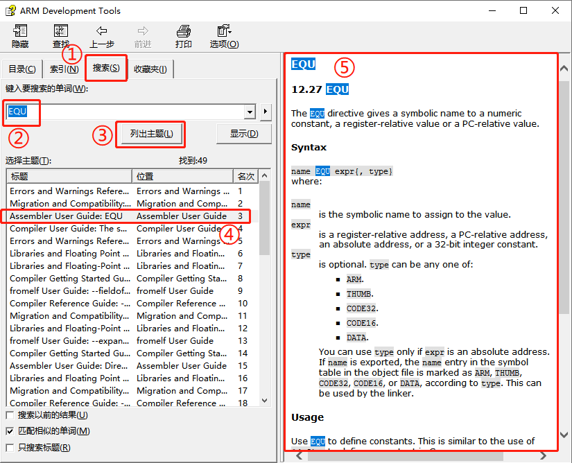

搜索到的标题有很多，我们只需要看Assembler User Guide 这部分即可。

## 4.3 Stack——栈

注：类似RTT的嵌入式RTOS中提供了独立的内存管理实现方式（`rt_malloc()`、`rt_free()`），由于RTT是采用动态内存堆的内存管理方式，因此**不需要在启动文件中申请堆**。RT-Thread中的heap使用`rt_system_heap_init`，把所有末使用的内存作为heap供`rt_malloc`使用。


------

> 此处8字节对齐的原因可以参考这个链接：[【烧脑技术贴】无法回避的字节对齐问题，从八个方向深入探讨(变量对齐，栈对齐，DMA对齐，结构体成对齐，Cache, RTOS双堆栈等) - STM32H7 - 硬汉嵌入式论坛 - Powered by Discuz! (armbbs.cn)](https://www.armbbs.cn/forum.php?mod=viewthread&tid=109400&highlight=%CE%DE%B7%A8%BB%D8%B1%DC%B5%C4%D7%D6%BD%DA%B6%D4%C6%EB%CE%CA%CC%E2)
>
> [关于MDK中8字节对齐问题 - 编程语言 - 硬汉嵌入式论坛 - Powered by Discuz! (armbbs.cn)](https://www.armbbs.cn/forum.php?mod=viewthread&tid=4916&page=1)

```c
; Amount of memory (in bytes) allocated for Stack
; Tailor this value to your application needs
; <h> Stack Configuration
;   <o> Stack Size (in Bytes) <0x0-0xFFFFFFFF:8>
; </h>

Stack_Size      EQU     0x00000400

                AREA    STACK, NOINIT, READWRITE, ALIGN=3
Stack_Mem       SPACE   Stack_Size
__initial_sp
    
// EQU：宏定义的伪指令，相当于等于，类似与C中的define。
// NOINIT表示不初始化；READWRITE表示可读可写，ALIGN=3，表示按照2^3对齐，即8字节对齐。
```

源码含义：开辟栈的大小为0x0000 0400(1KB)，段名为**STACK**，**NOINIT**表示不初始化，**READWRITE**表示可读可写，**ALIGN=3**表示按8（2^3）字节对齐 。

**AREA**：告诉汇编器汇编一个新的代码段或者数据段，**STACK**表示段名，这个可以任意命名。

**SPACE**：用于分配一定大小的内存空间，单位为字节，这里指定大小等于Stack_Size。

**__initial_sp**紧挨着 SPACE放置，表示栈的结束地址，栈是从高往低生长，所以结束地址就是栈顶地址。

> 栈的作用是用于局部变量，函数调用，函数形参等的开销，栈的大小不能超过内部SRAM的大小。如果编写的程序比较大，定义的局部变量很多，那么就需要在启动文件内修改栈的大小（Stack_Size）。
>
> 如果程序出现了莫名奇怪的错误，并进入了HardFault的时候，就要考虑下是不是栈不够大，溢出了。

## 4.4 Heap——堆

```c
; <h> Heap Configuration
;   <o>  Heap Size (in Bytes) <0x0-0xFFFFFFFF:8>
; </h>

Heap_Size       EQU     0x00000200

                AREA    HEAP, NOINIT, READWRITE, ALIGN=3
__heap_base
Heap_Mem        SPACE   Heap_Size
__heap_limit

                PRESERVE8
                THUMB
```

源码含义：开辟堆的大小为0X00000200（512字节），名字为HEAP，NOINIT表示不初始化，READWRITE表示可读可写，ALIGN=3表示8（2^3）字节对齐。

**PRESERVE8**：堆栈任何时候都得4字节对齐，在调用入口时需要8字节对齐，指定当前文件的堆栈按照8字节对齐。

**THUMB**：表示后面指令兼容THUMB指令。THUBM是ARM以前的指令集，16bit，现在Cortex-M系列的都使用THUMB-2指令集，THUMB-2是32位的，兼容16位和32位的指令，是THUMB的超集。

**__heap_base**表示堆的起始地址， **\_\_heap_limit**表示堆的结束地址。堆是由低向高生长的，跟栈的生长方向相反。

>  堆的作用是动态内存的分配，像`malloc()`、`calloc()`和`realloc()`函数申请的内存就在堆上面。堆中的内存一般由程序员分配和释放，若程序员不释放，程序结束时可能由操作系统回收，这个在STM32里面用的比较少，且一般是使用独立的而非系统提供的堆分配、释放函数，因此也可以考虑**将堆的大小设置为0**，以节省内存空间。

## 4.5 中断向量表

**向量表作用：**当内核响应了一个发生的异常后，对应的异常服务例程(ESR)就会执行。为了决定 ESR的入口地址， 内核使用了<u>向量表查表机制</u>。这里使用一张向量表。向量表其实是一个WORD（32 位整数）数组，每个下标对应一种异常，该下标元素的值则是该 ESR 的入口地址。向量表在地址空间中的位置是可以设置的，通过 NVIC 中的一个重定位寄存器来指出向量表的地址。在复位后，该寄存器的值为 0。因此，在地址 0 （即 FLASH 地址 0） 处必须包含一张向量表，用于初始时的异常分配。要注意的是这里有个另类： 0 号类型并不是什么入口地址，而是给出了复位后 MSP 的初值。向量表从 FLASH 的 0 地址开始放置，以 4 个字节为一个单位，地址 0 存放的是栈顶地址， 0X04 存放的是复位程序的地址，以此类推。从代码上看，向量表中存放的都是中断服务函数的函数名，而我们也知道 C 语言中的函数名就是一个地址。

> **用人话说：** 内核在异常时会访问这个表地址，并根据异常类型查表，按表跳转到异常处理函数执行。

首先是，创建向量表空间。

```c
; Vector Table Mapped to Address 0 at Reset
                AREA    RESET, DATA, READONLY
                EXPORT  __Vectors
                EXPORT  __Vectors_End
                EXPORT  __Vectors_Size
    
// EXPORT：声明一个标号可被外部的文件使用，使标号具有全局属性。如果是IAR编译器，则使用的是GLOBAL这个指令，如果是GCC编译器，则使用的是.global。
```

源码含义：定义一个数据段，名字为RESET，READONLY表示可读。

**EXPORT**：声明一个标号可被外部的文件使用，使标号具有全局属性。如果是IAR编译器，则使用的是GLOBAL这个指令。此处，声明\_\_Vectors、\_\_Vectors_End和__Vectors_Size这三个标号具有全局属性，可供外部的文件调用.

**我们通过检索map文件也可以检查到向量表的大小。**


**在RTT（GCC环境）下，我们也可以检索到类似内容。**


**可以发现向量表的位置对应的就是我们Code Flash的起始位置。**

当异常事件产生且被处理器内核接收后，对应的异常处理（ESR）就会执行。为了确定异常处理的起始地址，处理器利用了一种**向量表查表的机制**。向量表起始为一个WORD（32位整数）的数组，每一个下标对应一种异常，该下标元素的值则是该ESR的入口地址。向量表是可以重定位的，重定位由NVIC（Nested Vectored Interrupt Controllers）中名为向量偏移寄存器（VTOR）的可编程寄存器控制。复位后，VTOR默认为0，向量表则位于地址0x0000 0000处。

![image-20220926163905978](https://emoe-blog.oss-cn-hangzhou.aliyuncs.com/article_img/STM32%20%E5%90%AF%E5%8A%A8%E6%A8%A1%E5%BC%8F%E3%80%81%E5%90%AF%E5%8A%A8%E6%96%87%E4%BB%B6%E5%92%8C%E9%93%BE%E6%8E%A5%E8%84%9A%E6%9C%AC%E5%88%86%E6%9E%90_figures/image-20220926163905978.png

因此，在地址0x0000 0000（即Flash地址0）处必须要包含一张向量表，用于初始时的异常分配。

> 需要注意的是，地址0x0000 0000中的并不是程序入口地址，而是复位后给出的MSP初值。

------

以下为汇编文件中保存的中断向量表。

```
__Vectors       DCD     __initial_sp               		  ; Top of Stack				// 首地址为栈顶地址
                DCD     Reset_Handler              	      ; Reset Handler				// 次地址为中断服务函数的地址
                DCD     NMI_Handler                       ; NMI Handler
                DCD     HardFault_Handler                 ; Hard Fault Handler
                DCD     MemManage_Handler                 ; MPU Fault Handler
                DCD     BusFault_Handler                  ; Bus Fault Handler
                DCD     UsageFault_Handler                ; Usage Fault Handler
                DCD     0                                 ; Reserved
                DCD     0                                 ; Reserved
                DCD     0                                 ; Reserved
                DCD     0                                 ; Reserved
                DCD     SVC_Handler                       ; SVCall Handler
                DCD     DebugMon_Handler                  ; Debug Monitor Handler
                DCD     0                                 ; Reserved
                DCD     PendSV_Handler                    ; PendSV Handler
                DCD     SysTick_Handler                   ; SysTick Handler

                ; External Interrupts
                DCD     WWDG_IRQHandler                   ; Window WatchDog interrupt ( wwdg1_it)

                ...

                DCD     CRS_IRQHandler                    ; Clock Recovery Global Interrupt                                   
                DCD     ECC_IRQHandler                    ; ECC diagnostic Global Interrupt                                              
                DCD     SAI4_IRQHandler                   ; SAI4 global interrupt                                                
                DCD     0                                 ; Reserved                                 
                DCD     0                                 ; Reserved                                    
                DCD     WAKEUP_PIN_IRQHandler             ; Interrupt for all 6 wake-up pins 
                
__Vectors_End

__Vectors_Size  EQU  __Vectors_End - __Vectors
                // 中断向量表大小
```

**\_\_Vectors**为向量表起始地址，**__Vectors_End**为向量表结束地址，两个相减即可算出向量表大小，**\_\_Vectors_Size = \_\_Vectors_End - __Vectors**。

**DCD**：分配一个或者多个以字（4字节）为单位的内存，以4字节对齐，并要求初始化这些内存。每行**DCD**都会生成一个4字节的二进制代码，中断向量表中存放的实际上只是中断服务程序的入口地址。也即使用**DCD**分配一堆内存，并以异常（中断事件）的入口地址初始化它们。当异常（中断事件）发生时，CPU的中断系统将会将相应的入口地址赋值给PC程序计数器，之后开始执行中断服务程序。

> 向量表从FLASH的0地址开始放置，以4个字节为一个单位，**地址0x0存放的是栈顶地址，0x4存放的是复位程序的地址**，以此类推。从代码上看，向量表中存放的都是中断服务函数的函数名，可我们知道C语言中的函数名就是一个地址。

> 上面的这段代码是**建立中断向量表**，**中断向量表定位在代码段**的最前面。**具体的物理地址由链接器的配置参数决定**。如果程序在 Flash 运行，则中断向量表的起始地址是 0x08000000（IROM1 的地址）。以MDK为例，就是如下配置选项：

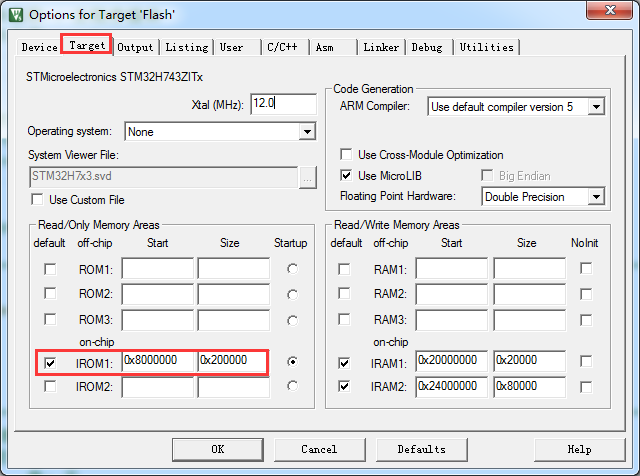

## 4.6 复位中断服务程序

在取出MSP后，PC指针寄存器指向`Reset_Handler`，并调用以下程序。

> 在GCC编译器下，语法结构会发生变化，如果是RTOS的话，也不一定是通过`__main()`来实现跳转（如RT-Thread下跳转到entry()），但整体上启动文件实现的功能大体上是这些。
>
> 此__main()函数由MDK封装，并调用<font color="#dd0000">**堆栈初始化部分的函数**</font>。
>
> 需要注意的是stm32f103的`SystemInit()`较为简单，但stm32h7系列的单片机的`SystemInit()`很复杂，在讨论到stm32h7时再做讨论。

```c
/*  定义一个名称为.text的代码段，可读 */
AREA    |.text|, CODE, READONLY

; Reset handler
Reset_Handler    PROC
                 EXPORT  Reset_Handler                    [WEAK]
        IMPORT  SystemInit
        IMPORT  __main

                 LDR     R0, =SystemInit
                 BLX     R0
                 LDR     R0, =__main
                 BX      R0
                 ENDP
```

源码含义：在 CODE区定义一个名为 .text的只读的代码段。

**PROC、ENDP**：定义子程序，这一对伪指令把程序段分为若干个过程，使程序的结构加清晰。

复位子程序是复位后第一个被执行的程序，主要是调用`SystemInit()`（标准库函数，在system_stm32f1xx.c中定义）配置系统时钟，这里(stm32f103)调用这个函数之后，单片机的系统时钟配被配置为72M，还有就是初始化FSMC/FMC总线上外挂的 SRAM(可选 )。然后在调用 C 库函数 `__main`，最终调用 `main` 函数去到 C 的世界。

**EXPORT**：声明复位中断向量 Reset_Handler为全局属性，这样外部文件就可以调用此复位中断服务。

**WEAK**：表示弱定义，如果外部文件优先定义了该标号则首先引用该标号，如果外部文件没有声明也不会出错。这里表示复位子程序可以由用户在其他文件重新实现（重定向），这里并不是唯一的。

**IMPORT**：表示该标号来自外部文件，跟C语言中的EXTERN关键字类似。这里表示`SystemInit`和`__main`这两个函数均来自外部的文件。

LDR、 BLX、 BX 是内核的指令，可在《 CM3 权威指南 CnR2》第四章 -指令集里面查询到。

**LDR**：表示从存储器中加载字到一个存储器中。

**BLX**：表示跳转到由寄存器给出的地址，并根据寄存器的 LSE 确定处理器的状态，还要把跳转前的下条指令地址保存到 LR。

**BX**：表示 跳转到由寄存器/标号给出的地址，不用返回。这里表示切换到 __main地址，最终调用 main函数，不返回，进入C的世界。

> `__main()`是一个标准的C库函数，主要作用是初始化用户堆栈，并在函数的最后调用`main`函数去到C的世界。

> 关于`__main()`的反汇编可以参考这些链接：[STM32_从SystemInit、__main到main() 已修正 - 蓝天上的云℡ - 博客园 (cnblogs.com)](https://www.cnblogs.com/yucloud/p/stm32_SystemInit_to_main.html)
>
> [STM32启动过程详解_Dream_Chaser2015的博客-CSDN博客_rt_lib_init](https://blog.csdn.net/hgsdfghdfsd/article/details/103812484)
>
> [Initialization (GNU Compiler Collection (GCC) Internals)](https://gcc.gnu.org/onlinedocs/gccint/Initialization.html)

**<span style="background:#FF9999;">根据这篇链接里的文章，我们可以看到`__main()`是一个标准的C库函数，`__main()`主要实现的功能有复制代码和数据，初始化`RW`段（复制已初始化的数据）、初始化`ZI`段（解压缩未初始化的数据），转入`__rt_entry()`，初始化堆栈（__user_initial_stackheap()，这个函数3.8节中提供）、初始化映像文件（`__rt_lib_init()`）、以及转入`main()`。（这些我们都可以对应着在GCC版本中找到）</span>**这也就是为什么我们写的程序都有一个`main`函数的原因。因为这是由C/C++标准实时库所规定的——并且不能更改，因为C/C++标准实时库并不对外界开放源代码。在进入了`main`函数后，我们就进入了C的世界，可以开始运行我们编写的应用程序。

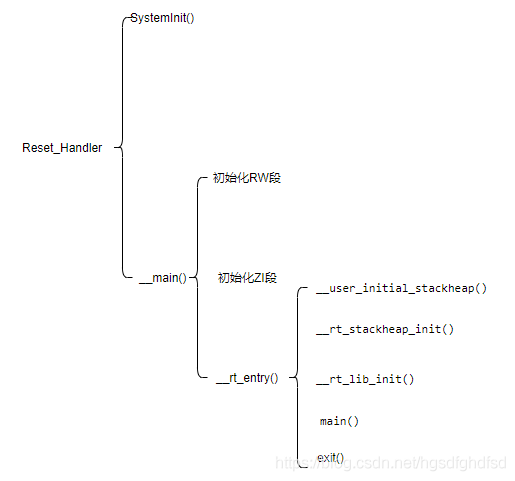


## 4.7 中断服务程序

在启动文件中，已经帮我们写好了所有中断的中断服务函数，但跟用户写在应用程序中的中断服务函数不同，这些函数都是空的（都被`WEAK`声明为弱定义函数，如果外部文件声明了一个标号，则优先使用外部文件定义的标号，如果外部文件没有定义也不会出错。），也即真正的中断复位服务程序**需要我们在外部的C文件里面重新实现，这里只是提前占了一个位置**（都是声明为弱定义，所以真正的中断服务函数需要我们在外部实现），一般都留在stm32xxx_it.c中实现**重定向**。

如果我们在使用某个外设的时候，开启了某个中断，但是又**<font color="#dd0000">忘记编写配套的中断服务程序或者函数名写错</font>**，那当中断来临的时，程序就会跳转到启动文件预先写好的空的中断服务程序中，并且在这个空函数中无线循环，即程序就死在这里。（原因是B指令的作用是跳转到一个标号，这里跳转到一个‘.’，表示无限循环。）

这里的系统异常中断部分是内核的，外部中断部分是外设的。

`B .`所代表的意思为跳转到当前位置，也即当系统报了NMI_Handler、HardFault_Handler等异常时，若该中断函数未定义，则系统会卡死在相应中断函数内。

```c
; Dummy Exception Handlers (infinite loops which can be modified)

NMI_Handler     PROC
                EXPORT  NMI_Handler                      [WEAK]
                B       .
                ENDP
HardFault_Handler\
                PROC
                EXPORT  HardFault_Handler                [WEAK]
                B       .
                ENDP
MemManage_Handler\
                PROC
                EXPORT  MemManage_Handler                [WEAK]
                B       .
                ENDP
BusFault_Handler\
                PROC
                EXPORT  BusFault_Handler                 [WEAK]
                B       .
                ENDP

...

                EXPORT  SAI4_IRQHandler                   [WEAK]                                                                                     
                EXPORT  WAKEUP_PIN_IRQHandler             [WEAK] 


WWDG_IRQHandler                                                          
PVD_AVD_IRQHandler                                             
TAMP_STAMP_IRQHandler

...

WAKEUP_PIN_IRQHandler

                B       .

                ENDP

                ALIGN
```

## 4.8 用户堆栈初始化

> 参考文档：《Libraries and Floating Point Support Guide》
>
> [rt-thread源码分析篇四：堆栈分配机制_lqonlylove的博客-CSDN博客](https://blog.csdn.net/OnlyLove_/article/details/119837369)

《Libraries and Floating Point Support Guide》文档中对堆栈描述如下：


**堆栈模型有2种：**
**1、单内存区域模型（堆栈共用一片空间）；**
**2、双内存区域模型（堆和栈都有独立空间）。**

```c
;*******************************************************************************
; User Stack and Heap initialization
;*******************************************************************************
                 IF      :DEF:__MICROLIB           		// 如果定义了微库
                
                 EXPORT  __initial_sp
                 EXPORT  __heap_base
                 EXPORT  __heap_limit
                
                 ELSE
                
                 IMPORT  __use_two_region_memory			// 堆栈使用双区域模型
                 EXPORT  __user_initial_stackheap
                 
__user_initial_stackheap

                 LDR     R0, =  Heap_Mem					// 堆首地址提供给R0
                 LDR     R1, =(Stack_Mem + Stack_Size)		// 栈底地址提供给R1
                 LDR     R2, = (Heap_Mem +  Heap_Size)		// 堆末尾地址提供给R2
                 LDR     R3, = Stack_Mem					// 栈顶地址提供给R3
                 BX      LR									// 跳转回__main()函数继续执行

                 ALIGN

                 ENDIF
                     
                 END 
                     
;************************ (C) COPYRIGHT STMicroelectronics *****END OF FILE*****
```

源码含义：

- 首先判断是否定义了`__MICROLIB`（**MDK特有的内容，自带的微库，是缺省，重新定义了标准C库中的常用函数，减小调用了标准C库中`printf`、`scanf`等函数的文件生成的代码大小，但执行速度会比标准C库慢，功能也比缺省C库少，MicroLIB没有源码，只有库**），如果定义了这个宏则赋予标号`__initial_sp`（栈顶地址）、`__heap_base`（堆起始地址）、`__heap_limit`（堆结束地址）全局属性，可供外部文件调用。有关这个宏我们在KEIL里面配置，具体见图使用微库。

> 关于MicroLIB更多知识可以看官方介绍 http://www.keil.com/arm/microlib.asp 。另外注意microlib只有库，没有源文件。下图是标准库和微库生成代码的比较。

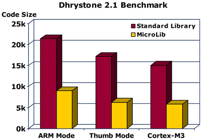

- 如果没有定义`__MICROLIB`，则才用双区域堆栈模型，且声明标号`__user_initial_stackheap`具有全局属性，堆栈的初始化由 C库函数`__main`来完成。
- 接下来进行堆栈空间初始化，堆是从低到高生长，栈是从高到低生长，是两个互相独立的数据段，并且不能交叉使用：
  1. `LDR     R0, =  Heap_Mem`：保存堆起始地址；
  2. `LDR     R1, =(Stack_Mem + Stack_Size)`：保存栈大小；
  3. `LDR     R2, = (Heap_Mem +  Heap_Size)`：保存堆大小；
  4. `LDR     R3, = Stack_Mem`：保存栈顶指针；
  5. `BX      LR`：跳转到 LR标号给出的地址（`main`函数），不用返回；
  6. `END`表示 到达文件的末尾，文件结束。

**IF,ELSE,ENDIF**：汇编的条件分支语句，跟C语言的if,else类似。

**IMPORT**：声明 `__use_two_region_memory`标号来自外部文件。
**EXPORT**：声明 `__user_initial_stackheap`具有全局属性，可被外部的文件使用。

**ALIGN**：表示对指令或者数据的存放地址进行对齐，一般需要跟一个立即数，缺省表示 4字节对齐。要注意的是，这个不是 ARM的指令，是编译器的。

**END**：文件结束 。


最后，<font color="#dd0000">**堆栈的初始化就由C库函数__rt_entry()**</font>来完成，这也解释了，**为什么在启动文件中，堆栈命名在前面，但实际上先执行的却是MSP和复位向量指针**。

当然，我们也可以结合实际情况，不选中`microlib`，编译后分析`map`文件。


或者，选中`microlib`，编译后分析`map`文件。


# 5 STM32链接脚本分析（基于MDK）

参考链接：DUI0377G_02_mdk_armlink_user_guide.pdf（可以在keil的帮助文档中找到，主要参考这个）

[sct文件编写与使用_theboynoName的博客-CSDN博客_keil sct文件解析](https://blog.csdn.net/qq_23274715/article/details/103445958)

[Arm 编译器 armlink 用户指南 6.11 版](https://developer.arm.com/documentation/100070/0611/scatter-file-syntax/load-region-descriptions)

MDK环境下的STM32的链接脚本文件，又被称为分散加载文件，是由Keil自定义的链接文件，就我们常见的分散加载文件`.sct`，通常十分简洁。

在MDK中，我们可以使用魔术棒中的工具，来实现分散加载文件的快速配置。


```
; *************************************************************
; *** Scatter-Loading Description File generated by uVision ***
; *************************************************************

LR_IROM1 0x08000000 0x00020000  {    ; load region size_region，定义一个加载域，域基地址为0x08000000，域大小为0x00020000，对应实际 Flash 的大小
  ER_IROM1 0x08000000 0x00020000  {  ; load address = execution address	定义一个运行域，第一个运行域的基地址必须和加载域的基地址相同
   *.o (RESET, +First)
   *(InRoot$$Sections)
   .ANY (+RO)
   .ANY (+XO)
  }
  RW_IRAM1 0x24000000 0x00080000  {  ; AXI SRAM 512K
   .ANY (+RW +ZI)
  }
}
```

一个分散加载文件由一个或者多个加载域描述(`load regions description`)组成。每个加载域描述由一个或者多个执行域描述(`execution regions description`)组成。执行域中又包含很多个输入节描述(`Input section description`)，关系图如下：

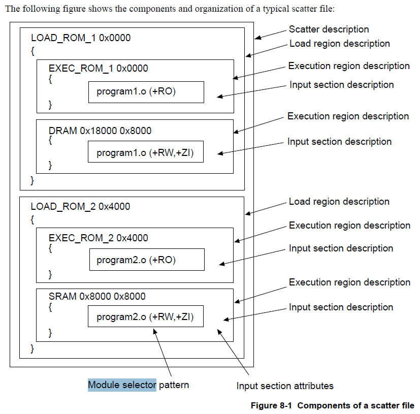

上图中的`.sct`文件包含两个加载域描述。每个加载域描述中又都包含两个执行域描述。每个执行域描述中包含一个输入节描述。

> 为什么要加上描述两个字呢？
>
> 因为这些并非真正的输入节和执行域，可重定位的目标文件中的输入节经过分散加载文件的描述映射到可执行或可共享的目标文件中的输出段/加载域。

分散加载的好处在于我们可以将变量和代码精确地存放在某个位置，特别是像STM32H7这种MCU，拥有多个RAM块，外置SDRAM空间，以及内部Flash和外置内存映射的QSPI Flash。 我们可以把时间关键代码放到`ITCM`里面运行，而占用空间超大，又不需要快速执行的代码放到`QSPI Flash`运行，都可以方便的配置。

> 后续3.1~3.3节翻译自DUI0377G_02_mdk_armlink_user_guide.pdf。

此外，以下很大的一部分是自己阅读文件并翻译的内容，实际意义不大，也不需要费心真的把这些看完，仅做了解的话，看硬汉giegie的视频就行：[第7期BSP驱动教程：MDK专题高级进阶，重要的分散加载使用，通过各种实战案例来学习_哔哩哔哩_bilibili](https://www.bilibili.com/video/BV1MR4y157XS/)

## 5.1 基本概念

以下，我们先对MDK的分散加载文件的基本概念做一定的介绍。

### 5.1.1 ARM ELF映像（`image`）的结构

一个ARM ELF映像包括节、域和段，每个链接阶段具有不同的映像视图。

一个映像文件的结构被定义为：

1. 组成映像的域和输出节的数量；
2. 加载映像时，这些域和节在内存中的位置；
3. 执行映像时，这些域和节在内存中的位置。

### 5.1.2 每个链接阶段的映像视图

每个链接阶段具有不同的映像视图。

#### 5.1.2.1 ELF目标文件视图（链接输入）

ELF目标文件视图包括输入节。ELF目标文件可以是：

1. 一个包含适用于与其他目标文件链接以创建可执行或可共享目标文件的代码和数据的可重定位文件；
2. 一个保存代码和数据的可共享的目标文件。

#### 5.1.2.2 链接视图

链接器有两个程序程序地址空间视图，当存在重叠的、位置无关的和可重定位的程序片段（代码或数据）时，这两个程序地址空间视图会变得不同：

1. 一个程序片段的加载地址是链接器期望外部代理（如程序加载器、动态链接器或调试器）从ELF文件复制片段的目标地址，这可能不是片段的地址；
2. 一个程序片段的执行地址是链接器在参与程序执行时期望片段驻留的目标地址。

如果一个片段是位置无关或可重定位的，它的执行地址可以在执行期间变化。

#### 5.1.2.3 ELF映像文件视图（链接输出）

ELF映像文件视图包括程序段和输出节：

1. 一个加载域对应于一个程序段；
2. 一个执行域包括一个或多个下列的输出节：
   - RO节（只读）；
   - RW节（可读写）；
   - XO节（可执行）；
   - ZI节（初始化为0）。

一个或多个执行域组成一个加载域。

当描述一个内存视图时：

1. 根域意味着拥有相同的加载和执行地址的域；
2. 加载域等同于ELF的段。

下列图片显示了每个链接阶段的视图之间的关系：

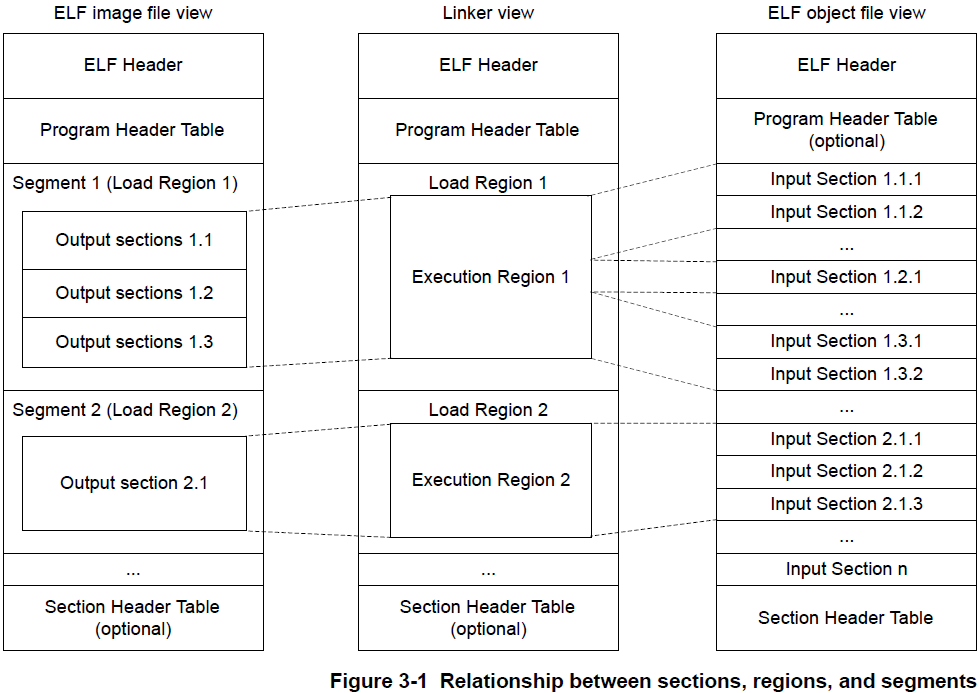

### 5.1.3 输入节、输出节、域和程序段

一个目标或映像文件由输入节、输出节、域和程序段的层次结构构成。

#### 5.1.3.1 输入节

一个输入节是来自于一个输入目标文件的一个独立节。输入节包含代码、初始化数据或描述在执行映像前未初始化或必须设置为0的内存片段。这些属性由RO、RW、XO和ZI等属性表示。armlink（armlink的链接器）使用这些属性将输入节分组为更大的构建块，称为输出节和域。

#### 5.1.3.2 输出节

一个输出节是一组具有相同RO、RW、XO或ZI属性的输入节，并且由链接器连续放置在内存中。输出节具有与组成它的输入节相同的属性。在输出节中，根据节放置规则对输入节进行排序。

#### 5.1.3.3 域

一个域最多包含四个输出节，具体取决于内容和具有不同属性的节的数量。默认情况下，域的输出节根据属性进行排序。首先是XO属性的输出节，然后是RO属性的输出节，最后是RW属性的输出节和ZI属性的输出节。域通常会映射到物理存储设备上，例如ROM、RAM或外围设备上，可以使用分散加载更改输出节的顺序。

#### 5.1.3.4 程序段

一个程序段对应于一个加载域，并且包含执行域。 程序段包含文本和数据等信息。

#### 5.1.3.5 存在只执行节（execute-only sections）的注意事项

1. 可以在一个执行域中混合XO和非XO节，但输出结果是一个RO节；
2. 如果输入文件具有一个或多个XO节，则链接器将生成单独的XO ELF段，在最后的映像中，除非使用分散加载文件或`--xo-base`选项另有指定，否则XO段紧接在RO段之后。

### 5.1.4 映像的加载视图和执行视图

映像域在加载时被放置到系统内存映射中。在执行中，内存中域的位置可能会改变。

在执行映像前，可能必须将映像的某些域移动到它们的执行地址，并创建ZI输出节。比如，初始化的RW数据可能需要从ROM的加载地址复制到RAM的执行地址。

映像的内存映射有以下几种不同的视图。

#### 5.1.4.1 加载视图

根据映像加载到内存中时所处的地址，即映像执行开始前的位置，描述每个映像的域和节。

#### 5.1.4.2 执行视图

根据映像执行期间所处的地址，描述每个映像的域和节。

------

下面的图像展示了一个不含只执行节（execute-only sections）的映像的加载和执行视图。

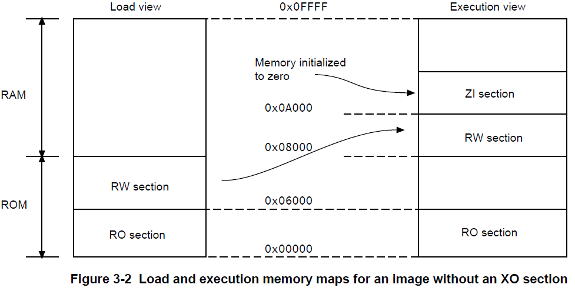

下面的图像展示了一个含一个只执行节（execute-only sections）的映像的加载和执行视图：


下表比较了加载和执行视图：

| 加载     | 描述                                                         | 执行     | 描述                                                 |
| -------- | ------------------------------------------------------------ | -------- | ---------------------------------------------------- |
| 加载地址 | 在包含节或域的映像开始执行前，将其加载到内存中的地址。<br/>节或非根域的加载地址可以与其执行地址不同。 | 执行地址 | 节或域所在的地址，其中包含了该节或域的映像正在执行。 |
| 加载域   | 一个加载域描述了加载地址空间中连续的内存块的布局。           | 执行域   | 一个执行域描述了在执行地址空间中连续的内存块的布局。 |

### 5.1.5 映像入口点

映像中的入口点是被加载到PC指针寄存器中的位置，是程序执行开始的位置。尽管一个映像中可以有多个入口点，但在链接过程中，只可以指定一个。

并不是每一个ELF文件都必须有一个入口点，一个ELF文件中不允许存在多个入口点。

> 对于嵌入式 Cortex-M 内核的程序，程序的执行是从复位向量所在的位置（地址）开始执行。复位向量会被加载到 PC 寄存器中，且复位向量的位置（地址）并不固定。 通常，复位向量指向 CMSIS 的 Reset_Handler 函数。

#### 5.1.5.1 入口点类型

有两种不同类型的入口点。

**初始化入口点：**

镜像的初始入口点是存储在 ELF 头文件中的单个值。 对于那些需要由操作系统或引导加载程序加载到 RAM 中的程序，加载程序通过将控制转移到镜像中的初始入口点来启动镜像执行。

一个镜像只能有一个初始化入口点。初始入口点可以是，但并不必须是，ENTRY 指令设置的入口点之一。

**ENTRY 指令指定的入口点：**

可以为一个镜像从多个可能的入口点中选择一个入口点。每个镜像只能有一个入口点。

可以在汇编程序文件中<u>使用 ENTRY 指令</u>在目标中创建入口点。 在嵌入式系统中，该指令的典型用途是标记进入处理器异常向量（例如 RESET，IRQ 和 FIQ）的代码。

该指令使用 ENTRY 关键字标记输出代码部分，该关键字指示链接器在执行未使用的部分消除时不删除该部分。

对于 C/C++ 程序，C 库 中的 __main() 函数就是入口点。

如果加载程序要使用一个嵌入式映像，则必须在标头中指定一个初始入口点。 使用`--entry`命令行选项选择入口点。

#### 5.1.5.2 映像的初始入口点

一个映像只能有一个初始入口点，否则会报`L6305W`警告。

初始入口点必须满足以下条件：

1. 映像的入口点必须位于执行域中；
2. 执行域必须不能覆盖另一个执行域，且必须是根执行域，即加载地址与执行地址相同。

如果没有使用`--entry`命令行选项来指定初始入口点，那么：

1. 如果输入目标值包含一个由`ENTRY`指令定义的入口点，链接器使用该入口点作为映像的初始入口点；
2. 在以下情况下，链接器生成一个不包含一个入口点的映像：
   - 使用`ENTRY`指令来指定超过一个入口点；
   - 没有使用`ENTRY`指令指定入口点。

对于ROM为0的嵌入式应用使用`--entry 0x0`命令，或对使用高矢量的处理器选择`0xFFFF0000`。

## 5.2 基本语法

### 5.2.1 BNF符号

分散加载描述语法使用了标准的BNF符号。

下表总结了用于描述分散加载描述的语法的巴科斯范式（Backus-Naur Form，BNF）符号。

| Symbol  | Description                                                  |
| ------- | ------------------------------------------------------------ |
| `"`     | Quotation marks indicate that a character that is normally part of the BNF syntax is used as a literal character in the definition. The definition `B"+"C`, for example, can only be replaced by the pattern `B+C`. The definition `B+C` can be replaced by, for example, patterns `BC`, `BBC`, or `BBBC`. |
| A ::= B | Defines A as B. For example, `A::= B"+" | C` means that A is equivalent to either `B+` or `C`. The `::=` notation defines a higher level construct in terms of its components. Each component might also have a `::=` definition that defines it in terms of even simpler components. For example, `A::= B` and `B::= C | D` means that the definition A is equivalent to the patterns `C` or `D`. |
| [A]     | Optional element A. For example, `A::= B[C]D` means that the definition `A` can be expanded into either `BD` or `BCD`. |
| A+      | Element A can have one or more occurrences. For example, `A::= B+` means that the definition `A` can be expanded into `B,` `BB`, or `BBB`. |
| A*      | Element A can have zero or more occurrences.                 |
| A \| B  | Either element A or B can occur, but not both.               |
| (A B)   | Element A and B are grouped together. This is particularly useful when the \| operator is used or when a complex pattern is repeated. For example, `A::=(B C)+ (D | E)` means that the definition `A` can be expanded into any of `BCD,` `BCE`, `BCBCD`, `BCBCE`, `BCBCBCD`, or `BCBCBCE`. |

### 5.2.2 分散加载文件的语法

一个分散加载文件包括一个或多个加载域。每个加载域可以包含一个或多个执行域。

下列的图像显示了一个典型的分散加载文件的组成部分和组织结构：

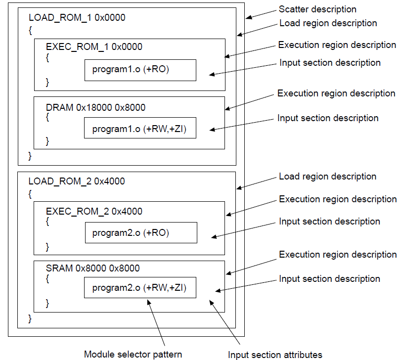

### 5.2.3 加载域描述

**加载域描述指定了其子执行域在内存区域内的放置方式。**

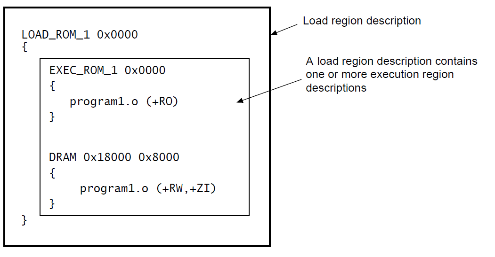

#### 5.2.3.1 加载域描述的语法

加载域描述的组成部分允许独一无二地定义一个加载域和控制一个ELF文件的哪个部分放置在那个域中。

BNF下，加载域描述的语法如下：

```
load_region_description ::=
	load_region_name (base_address | ("+" offset)) [attribute_list] [max_size]
        "{"
        execution_region_description+
        "}"
```

一个加载域描述有以下的组成部分：

1. 名称（`load_region_name`）：命名加载域。可以使用带引号的名称，仅当使用任何域相关的链接器定义的符号时，名称才区分大小写；

2. 基地址（`base_address`）：指定链接区域的对象的地址，`base_address`必须满足对齐要求；

3. 偏移（`"+" offset`）：描述超过前一个加载域末尾`offset`字节的一个基地址。`offset`的值必须按4字节对齐，如果是第一个加载域，`"+" offset`表示基址从0的`offset`字节偏移处开始；

   如果使用`"+" offset`，则加载域可能会从先前的加载域继承某些属性。

4. 属性列表（`attribute_list`）：指定加载域内内容的属性；

5. 加载域大小（`max_size`，可选）：指定加载域的大小，这是在进行任何解压或零初始化之前的加载域大小，如果指定了可选的`max_size`值，那么如果域分配了超过`max_size`字节，`armlink`将生成错误；

6. 执行域描述（`execution_region_description`）：指定执行域的名称，地址和内容，一个加载域包含一个或多个执行域描述。

> BNF定义包含额外的行返回和空格，以提高可读性。分散加载描述中不需要它们，如果存在于分散文件中，则忽略它们。

### 5.2.4 执行域描述

**一个执行域描述指定了运行时放置映像部分的内存区域。**


#### 5.2.4.1 执行域描述的语法

执行域描述的组成部分允许独一无二地标识每一个执行域及其在父加载域中的位置，并控制ELF文件的哪些部分放置在该执行域中。

BNF下，执行域描述的语法如下：

```
execution_region_description ::=
	exec_region_name (base_address | "+" offset) [attribute_list] [max_size | length]
        "{"
        input_section_description*
        "}"
```

1. 名称（`exec_region_name`）：命名执行域。可以使用带引号的名称，仅当使用任何域相关的链接器定义的符号时，名称才区分大小写；
2. 基地址（`base_address`）：指定链接区域的对象的地址，`base_address`必须满足对齐要求；

> 在执行域上使用`ALIGN`，使加载域和执行域一同对齐。

3. 偏移（`"+" offset`）：描述超过前一个执行域末尾`offset`字节的一个基地址。`offset`的值必须按4字节对齐，如果是第一个执行域，`"+" offset`表示基址从包含于的加载域的`offset`字节偏移处开始；

   如果使用`"+" offset`，则执行域会从父加载域继承某些属性，或从统一加载域的前一个执行域继承某些属性。

4. 属性列表（`attribute_list`）：指定执行域内内容的属性；

5. 执行域大小（`max_size`，可选）：指定执行域的大小，对于标记为`EMPTY`或`FILL`的执行域，`max_size`值被解释为域的长度。否则，`max_size`值将被解释为执行域的最大大小；

6. 长度（`length`）：只能与`EMPTY`一起使用，以表示在内存中增长的堆栈。如果长度为负值，则将`base_address`作为域的结束地址；

7. 输入节描述（`input_section_description`）：指定输入节的内容。

> BNF定义包含额外的行返回和空格，以提高可读性。分散加载描述中不需要它们，如果存在于分散文件中，则忽略它们。

### 5.2.5 输入节描述

输入节描述是标识输入节的模式。


#### 5.2.5.1 输入节描述的语法

输入节描述指定将哪些输入节加载到父执行域中。

BNF下，输入节描述的语法如下：

```
input_section_description ::=
	module_select_pattern
		[ "(" input_section_selector ( "," input_section_selector )* ")" ]
input_section_selector ::=
		("+" input_section_attr | input_section_pattern | input_symbol_pattern | section_properties)
```

1. 模块匹配模式（`module_select_pattern`）：模式由字面文本构建。当程序块匹配模式与以下之一匹配时，输入节与程序块匹配模式匹配：

   - 包含该节的目标文件的名称；
   - 库成员的名称（不带前导路径名）；
   - 从中提取节的库的全名（包括路径名），如果名称包含空格，需要使用通配符，例如，使用`*libname.lib`匹配`C:\lib dir\libname.lib`。

   通配符`*`匹配0个或多个字符，`?`匹配任意单个字符。

   匹配不区分大小写，即使在区分大小写文件命名的主机上也是如此。

   `*.o` 匹配任何目标文件，使用`*` 匹配任何目标文件或库。

   可以使用被引用的文件名，如`"file one.o"`。

   分散文件中不能有两个`*` 模块选择器。但可以使用两个修改后的模块选择器，如`*A`和`*B`，并且，可以同时使用一个有`*` 选择器的`.ANY`选择器。

   `*` 模块选择器拥有比`.ANY` 模块选择器更高的优先级。

   如果文件中包含`*`  模块选择器的部分被删除，`.ANY`模块选择器将激活。

2. 输入节属性（`input_section_attr`）：与输入节属性匹配的属性选择器（attribute selector）。每个`input_section_attr`后跟一个`+`。 如果要指定与输入节名称匹配的模式，则名称前面必须有`+`。选择器不区分大小写。可识别以下选择器：

   - RO-CODE
   - RO-DATA
   - RO，用来同时选择RO-CODE和RO-DATA
   - RW-DATA
   - RW-CODE
   - RW，用来同时选择 RW-CODE 和 RW-DATA
   - XO
   - ZI
   - ENTRY，包含`ENTRY`点的节

   可以识别以下同义词：

   - CODE for RO-CODE
   - CONST for RO-DATA
   - TEXT for RO
   - DATA for RW
   - BSS for ZI

   可以识别以下伪属性：

   - FIRST
   - LAST

   如果放置顺序很重要，请用`FIRST`和`LAST`标记执行区域中的第一节和最后一节。例如，如果特定的输入节必须是域中的首位，而包含校验和的输入部分则必须是末位。一个执行区域只能有一个`FIRST`或一个`LAST`属性，并且它必须跟在一个`input_section_attr`后面。例如：

   ```
   *(section, +FIRST)			# This pattern is correct.
   *(+FIRST, section)			# This pattern is incorrect and produces an error message.
   ```

3. 输入节模式（`input_section_pattern`）：与输入节名称匹配的模式，不区分大小写。它是由字面文本构成的。通配符`*`匹配0个或多个字符，以及`?`匹配任何单个字符，可以使用带引号的输入节名称。

   > 如果使用不止一个的输入节模式，请确保不同的执行域中没有重复的模式以避免歧义错误。

4. 输入符号模式（`input_symbol_pattern`）：可以通过节定义的全局符号的名字来选择输入节，这允许用户从部分链接的对象中选择具有相同名称的各个节。

   `:gdef:`前缀区分全局符号模式和节模式。例如使用`:gdef:mysym`来选择定义为`mysym`的节。以下的例子中显示了一个分散加载文件，其中`ExecReg1`包含定义全局符号`mysym1`的节和包含全局符号`myym2`的节：

   ```
   LoadRegion 0x8000
   {
   	ExecReg1 +0
   	{	
           *(:gdef:mysym1)
           *(:gdef:mysym2)
   	}
   			; rest of scatter-loading description
   }
   ```

   可以使用一个引号引起的全局符号模式。`:gdef:`前缀可以在引号内或引号外。

   > 如果使用不止一个输入符号模式（`input_symbol_pattern`），请确保不同的执行域中没有重复的模式以避免歧义错误。
   >
   > 输入节描述符的顺序不重要。

5. 节特性（`section_properties`）： 可以是 `+FIRST`，`+LAST` 和 `OVERALIGN value`。其中，OVERALIGN 中的值必须为 2 的正幂，并且必须大于或等于 4。

> - 只有匹配`module_select_pattern`和至少一个`input_section_attr`或`input_section_pattern`的输入节会被包含于执行域中。如果省略（`+input_section_attr`）或（input_section_pattern），则默认值为`+RO`。
> - 不要依赖于编译器生成或ARM库代码库代码使用的的输入节名。例如，使用不同的编译器选项，这些选项可能会在编译之间发生变化。此外，编译器使用的节命名约定不能保证在发行版之间保持不变。
> - BNF定义包含额外的行返回和空格，以提高可读性。分散加载描述中不需要它们，如果存在于分散文件中，则忽略它们。

## 5.3 分散加载功能

### 5.3.1 分散加载机制

分散加载机制允许用户使用文本文件中的描述指定映像到链接器的内存映射。

#### 5.3.1.1 分散加载概述

分散加载使用户可以完全控制映像组成部分的分组和放置。

可以使用分散加载来创建简单的映像，但通常只用于具有复杂内存映射的映像。也就是说，在加载和执行时，多个内存区域分散在内存映射中。

映像内存映射由域和输出节组成，内存映射的每个域具有不同的加载和执行地址。

为了构建一个映像的内存映射，链接器必须有：

1. 描述输入节如何分组成输出节和域的分组信息；
2. 描述域在内存映射中的地址的位置信息。

<u>当链接器创建一个使用分散加载文件的映像，它会创建一些域相关的符号。只有当用户代码引用它们时，链接器才会创建这些特殊符号。</u>

#### 5.3.1.2 何时使用分散加载

实现嵌入式系统通常需要分散加载，因为这些系统需要使用ROM、RAM和内存映射的外围设备。

需要分散加载或使用分散加载非常有用的情况：

1. 复杂的内存映射：必须放入许多不同内存区域的代码和数据，需要详细说明将这些部分放在内存空间中的哪些位置。
2. 不同类型的内存：许多系统包含各种物理存储设备，如FLASH、ROM、SDRAM和快速SRAM。分散加载描述可以将代码和数据与最合适的内存类型匹配。例如，中断代码可以放入快速SRAM以提高中断响应时间，但不经常使用的配置信息可以被放入较慢的闪存中。
3. 内存映射类型的外设：分散加载描述可以将一个数据节放置在内存映射的精确地址，以便可以访问内存映射的外围设备。
4. 固定位置的函数：即使周围的应用程序已被修改和重新编译，函数也可以放在内存中的统一位置。这对于跳转表的实现非常有用。
5. 使用符号标识堆和堆栈：链接应用程序时，可以为堆和堆栈位置定义符号。

### 5.3.2 根执行域

根域是一个有相同的加载和执行地址的域。

#### 5.3.2.1 初始化入口点

映像的初始化入口点必须是一个根域。

如果初始化入口点不是根域，链接会失败，链接器会给出错误信息。

以下就是一个根域的例子。

```
LR_1 0x040000 			; load region starts at 0x40000
{ 						; start of execution region descriptions
	ER_RO 0x040000 		; load address = execution address
	{
		* (+RO) 		; all RO sections (must include section with
						; initial entry point)
	}
	… 					; rest of scatter-loading description
}
```

#### 5.3.2.2 `ABSOLUTE`属性

可以使用`ABSOLUTE`属性指定根执行域。

将`ABSOLUTE`指定为执行域的属性，可以显式指定，也可以允许其默认，并将相同的地址用于第一个执行域和封闭的加载域。

要使执行域地址与加载域地址相同，请执行以下任一操作：

1. 为执行域的基址和加载域的基地址指定相同的数值；
2. 为加载域中的第一个执行域指定`+0`偏移。

如果为加载域中的所有后续执行域指定了零（`+0`）的偏移，则不在包含`ZI`的执行域之后的所有执行域也是根域。

```
LR_1 0x040000 		; load region starts at 0x40000
{ 					; start of execution region descriptions
	ER_RO 0x040000	; load address = execution address
    {
        * (+RO) 	; all RO sections (must include section with
        			; initial entry point)
    }
    … 				; rest of scatter-loading description
}
```

#### 5.3.2.3 `FIXED`属性

可以使用分散加载文件中执行域的FIXED属性来创建在固定地址加载和执行的根域。

使用`FIXED`执行域属性确保特定域的加载地址和执行地址相同，可以使用`FIXED`属性将任何执行域放置在ROM中的特定地址。
例如，以下内存映射显示了固定的执行域：


以下示例显示了相应的分散加载描述：

```
LR_1 0x040000 				; load region starts at 0x40000
    { 						; start of execution region descriptions
    ER_RO 0x040000 			; load address = execution address
    {
    	* (+RO) 			; RO sections other than those in init.o
    }
    ER_INIT 0x080000 FIXED 	; load address and execution address of this
    						; execution region are fixed at 0x80000
    {
    	init.o(+RO) 		; all RO sections from init.o
    }
    … 						; rest of scatter-loading description
}
```

可以使用它将函数或数据块（如常量表或校验和）放置在ROM中的固定地址，以便通过指针轻松访问。
例如，如果指定将一些初始化代码放在ROM的开头，将校验和放在ROM末尾，则某些内存内容可能未使用。使用`*`或`.ANY`模块选择器来填充初始化块结束和数据块开始之间的区域。
为了使代码更易于维护和调试，建议您在分散加载文件中使用最小数量的放置规范，并将函数和数据的详细放置留给链接器。

> 在某些情况下，使用`FIXED`和单个加载域是不合适的。指定固定位置的其他技术包括：
>
> - 如果加载器可以处理多个加载区域，请将RO代码或数据放置在其自己的加载域中。
>
> - 如果不要求函数或数据位于ROM中的固定位置，请使用`ABSOLUTE`而不是`FIXED`。然后，加载器将数据从加载区域复制到RAM中的指定地址。
>
>   ABSOLUTE是默认属性。
>
> - 要将数据结构放置在内存映射I/O的位置，请使用两个加载区域并指定`UNINIT`。`UNINIT`确保内存位置未初始化为零。

### 5.3.3 使用`.ANY`模块选择器放置未分配的部分

链接器试图将输入节放入特定的执行区域。对于任何无法解析的输入节，如果这些部分的位置不重要，可以在分散文件中使用`.ANY`模块选择器。
在大多数情况下，使用单个`.ANY`选择器等同于使用`*`模块选择器。但是，与`*`不同，您可以在多个执行域中指定`.ANY`。

#### 5.3.3.1 使用多个`.ANY`模块选择器时的放置规则

当使用多个`.ANY`选择器时，链接器具有放置节的默认规则。
当分散加载文件中存在多个`.ANY`选择器时，链接器将按大小降序对节进行排序。然后，<u>它获取大小最大的未分配节，并将该节分配给具有足够可用空间的任何特定执行域。（与`*`模块选择器的主要不同，`*`不会做这种选择，[第7期BSP驱动教程：MDK专题高级进阶，重要的分散加载使用，通过各种实战案例来学习_哔哩哔哩_bilibili](https://www.bilibili.com/video/BV1MR4y157XS/)）</u>例如，`.ANY(.text)`被判断为比`.ANY(+RO)`更具体。
如果多个执行区域同等特定，则将该节分配给剩余空间最多的执行域。
例如：

1. 如果您有两个同样特定的执行域，其中一个域的大小限制为0x2000，另一个域没有限制，那么所有节都将分配给第二个无界`.ANY`域。
2. 如果您有两个同样特定的执行域，其中一个区域的大小限制为0x2000，另一个区域为0x3000，则将要放置的第一个节分配给第二个`.ANY`域大小限制为0x3000的区域，直到第二个`.ANY`域的剩余大小将减小为0x2000。从此开始，在两个`.ANY`执行区域之间交替分配节。

可以使用执行域属性`ANY_SIZE`指定用于未分配节的最大空间量。

## 5.4 链接脚本分析

我们可以回到我们的链接脚本文件，并对其做一定的分析。

```
; *************************************************************
; *** Scatter-Loading Description File generated by uVision ***
; *************************************************************

LR_IROM1 0x08000000 0x00020000  {    ; load region size_region，定义一个加载域，域基地址为0x08000000，域大小为0x00020000，对应实际 Flash 的大小
  ER_IROM1 0x08000000 0x00020000  {  ; load address = execution address	定义一个执行域，第一个执行域的基地址必须和加载域的基地址相同，这是一个根域
   *.o (RESET, +First)				
   *(InRoot$$Sections)
   .ANY (+RO)
   .ANY (+XO)
  }
  RW_IRAM1 0x24000000 0x00080000  {  ; AXI SRAM 512K
   .ANY (+RW +ZI)
  }
}
```

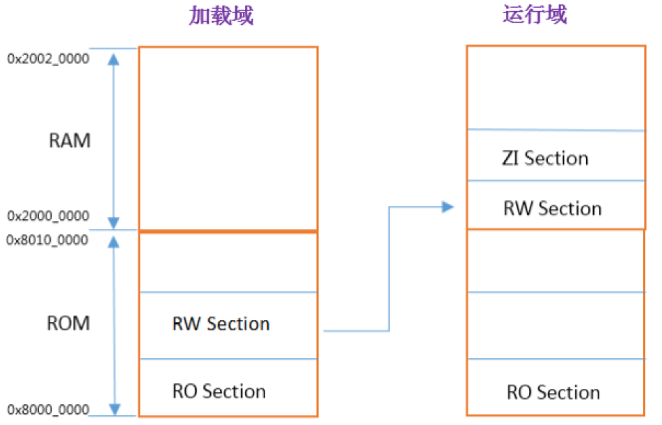

### 5.4.1 加载域

`LR_IROM1 0x08000000 0x00020000`定义了一个加载域，加载域的名称是`LR_IROM1` ，域基地址为0x08000000，域大小为0x00020000，对应实际 Flash 的大小。

### 5.4.2 执行域

`ER_IROM1 0x08000000 0x00020000`定义一个执行域，第一个执行域的基地址必须和加载域的基地址相同，这是一个根域。

`*.o`匹配所有以`.o`结尾的文件，`(RESET, +First)`限制了必须含有`RESET`节（以下内容），且将该节内容放在根域的起始地址内。

```assembly
; Vector Table Mapped to Address 0 at Reset
                AREA    RESET, DATA, READONLY
                EXPORT  __Vectors
                EXPORT  __Vectors_End
                EXPORT  __Vectors_Size

// EXPORT：声明一个标号可被外部的文件使用，使标号具有全局属性。如果是IAR编译器，则使用的是GLOBAL这个指令，如果是GCC编译器，则使用的是.global。
```

`*(InRoot$$Sections)`匹配的是IDE自带的部分函数（MDK的一些库文件），比如`__main.o`，`_scatter*.o`，`_dc*.o`，必须放置在根域中。

`.ANY (+RO)`匹配所有具有RO只读属性的数据。

`.ANY (+XO)`匹配所有XO属性的数据（只可执行的代码）的内容。关于XO节，可以参考[MDK的Option选择中execute-only code区的作用 - 开发环境 - 硬汉嵌入式论坛 - Powered by Discuz! (armbbs.cn)](https://www.armbbs.cn/forum.php?mod=viewthread&tid=110924&highlight=execute)

`RW_IRAM1 0x24000000 0x00080000`定义一个执行域，这个域是一个存放RW和ZI数据的域，域基地址为0x24000000，域大小为0x00080000，对应实际 SRAM的大小。

`.ANY (+RW +ZI)`匹配任意RW和ZI属性的数据。

# 6 参考链接

[ARM 内核寄存器 和 基本汇编语言讲解_矜辰所致的博客-CSDN博客_arm汇编语言](https://blog.csdn.net/weixin_42328389/article/details/121855164)

[FreeRTOS记录（三、RTOS任务调度原理解析_Systick、PendSV、SVC）_矜辰所致的博客-CSDN博客_freertos任务调度原理](https://blog.csdn.net/weixin_42328389/article/details/121067474)

[ARM汇编语言入门 - 知乎 (zhihu.com)](https://zhuanlan.zhihu.com/p/109057983)

[Writing ARM Assembly (Part 1) | Azeria Labs (azeria-labs.com)](https://azeria-labs.com/writing-arm-assembly-part-1/) 

MiniPro STM32H750 开发指南_V1.1.pdf

[【蛋饼嵌入式】我提着鞋带拎自己？嵌入式芯片启动过程全解析，彻底理解bootloader_哔哩哔哩_bilibili](https://www.bilibili.com/video/BV1AN411R7Be/)

[AN2606 PDF](https://www.st.com/content/ccc/resource/technical/document/application_note/b9/9b/16/3a/12/1e/40/0c/CD00167594.pdf/files/CD00167594.pdf/jcr:content/translations/en.CD00167594.pdf)）

[【不是问题的问题】为什么STM32的Flash地址要设置到0x08000000 - STM32H7 - 硬汉嵌入式论坛 - Powered by Discuz! (armbbs.cn)](https://www.armbbs.cn/forum.php?mod=viewthread&tid=109321)

[Documentation – Arm Developer](https://developer.arm.com/documentation/ka001328/latest)

[gcc链接脚本ld 实例讲解 - solonj - 博客园 (cnblogs.com)](https://www.cnblogs.com/solo666/p/16639842.html)

[介紹 | RISC-V 指令集手册（卷一） (gitbooks.io)](https://fmrt.gitbooks.io/riscv-spec-v2-cn/content/index.html)

AAPCS:《Procedure Call Standard for the ARM Architecture》

DUI0377G_02_mdk_armlink_user_guide.pdf

[MDK的Option选择中execute-only code区的作用 - 开发环境 - 硬汉嵌入式论坛 - Powered by Discuz! (armbbs.cn)](https://www.armbbs.cn/forum.php?mod=viewthread&tid=110924&highlight=execute)

[Arm Cortex-M7 Processor Technical Reference Manual r1p2](https://developer.arm.com/documentation/ddi0489/f/)

[ARMv7-M Architecture Reference Manual](https://developer.arm.com/documentation/ddi0403/ee)

<u>**参考链接完完全全不止这些，这篇文章完完全全就是个人整理的缝合怪，可以联系并修改，错误和遗漏的点，麻烦各位老哥指出，我也很乐意修改。😭😭😭**</u>
